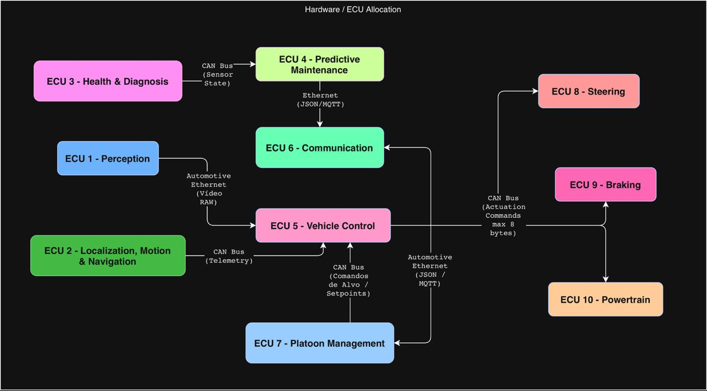

# Iduce - Sprint 1

Grupo 1 - Rodrigo Pinto, Rodrigo Bolelho, Martim Botelho

## Índice
1. [Introdução](#11-introdução)
2. [Planeamento do Sprint 1 (PMDEV)](#12-planeamento-do-sprint-1-pmdev)
3. [Design de Arquitetura (VEVCA)](#13-design-de-arquitetura-vevca)
4. [Real-Time OS (RTOPR)](#14-real-time-os-rtopr)
5. [Tecnologias de Comunicação (SYOSY)](#15-tecnologias-de-comunicação-syosy)
6. [Conclusão](#16-conclusão)


## 1.1. Introdução
Este documento apresenta a análise e o planeamento para a implementação de um sistema de gestão de pelotão de veículos autónomos no contexto da unicade curricular de IDUCE (Engenharia de Casos de Uso Focados na Indústria). Este projeto foca-se na definição da arquitetura do sistema, na escolha do Sistema Operativo de Tempo Real (RTOS) e das tecnologias de comunicação a utilizar. O objetivo é criar um sistema robusto e eficiente que permita a coordenação eficaz entre os veículos do pelotão, garantindo a segurança e a fiabilidade das operações. 

## 1.2 Planeamento do Sprint 1 (PMDEV)

O planeamento do sprint 1 foi feito no primeiro dia do sprint, e teve como resultado o seguinte plano de atividades:


Os principais marcos do sprint 1 incluem:
- Construção do design de arquiterura;
- Estudo, análise e escolha do RTOS a utilizar e das suas funcionalidades chave;
- Estuda, análise e escolha das tecnologias de comunicação a utilizar;

<div style="page-break-after: always"></div>

## 1.3 Design de Arquitetura (VEVCA)

A seguinte secção apresenta o design de arquitetura proposto para o sistema de monitorização de *platooning*, incluindo a alocação dos componentes pelas ECUs e a justificação da mesma.

### Diagrama de Arquitetura

O diagrama apresenta a arquitetura proposta para o sistema de monitorização de *platooning*. A arquitetura representa os principais subsistemas do veículo, os sensores e atuadores físicos, e os fluxos de informação usados para trocar dados entre os componentes de software.

A arquitetura foi definida de forma a representar diretamente as dependências entre sensores, módulos de decisão, comunicação, gestão do *platoon* e atuadores. Neste caso, as ligações entre blocos representam interfaces lógicas de dados entre produtores e consumidores de informação. Assim, as setas entre sensores, módulos e atuadores indicam que dados são fornecidos e por quem são consumidos, sem introduzir camadas intermédias adicionais no diagrama.


As cores do diagrama representam a alocação lógica dos componentes pelas ECUs. Assim, o mesmo diagrama mostra simultaneamente os fluxos entre sensores, módulos e atuadores, e a distribuição proposta dos componentes pelas unidades computacionais do veículo.

Esta opção mantém a arquitetura simples e focada nos principais fluxos de dados do sistema. As interfaces são representadas diretamente pelas ligações entre componentes, em vez de serem modeladas como blocos físicos separados. Desta forma, o diagrama evidencia as relações entre sensores, módulos de decisão, comunicação, gestão do *platoon* e atuadores.

O *Vehicle Control* é responsável pelas decisões de curto prazo, como acelerar, travar ou virar, e envia comandos para os atuadores de *Steering*, *Braking* e *Powertrain*. A *Navigation* fornece informação de rota ao *Vehicle Control*. O *Platoon Management* mantém a visão do estado do *platoon* e fornece decisões de nível superior ao *Vehicle Control*. O *Predictive Maintenance* monitoriza o estado do veículo e, dependendo do papel do veículo, comunica os seus resultados ao *Platoon Management*, quando o veículo atua como líder, ou ao *Communication*, quando o veículo atua como seguidor.

No caso dos seguidores, uma potencial avaria detetada pelo *PredMaint* é enviada através do *COMM* para o veículo líder. No líder, o *COMM* encaminha a informação recebida para o *PlatMgmt*, que atualiza a visão global do *platoon*. Caso seja necessário encostar à berma, o *PlatMgmt* influencia o *VC* do líder, e os seguidores continuam a replicar a trajetória do líder de acordo com o comportamento de *platooning*.

#### Alocação Hardware/Software por ECU

| ECU | Nome | Componentes |
| --- | --- | --- |
| ECU 1 | *Perception ECU* | Cameras, LiDAR, Ultrasonic Sensors |
| ECU 2 | *Localization, Motion & Navigation ECU* | GPS, Wheel Speed Sensor, Steering Sensor, NAV |
| ECU 3 | *Health & Diagnostics ECU* | Tyre Pressure Sensors, Engine Temperature Sensors, Brake Status Sensors |
| ECU 4 | *Predictive Maintenance ECU* | PredMaint |
| ECU 5 | *Vehicle Control ECU* | VC |
| ECU 6 | *Communication ECU* | COMM |
| ECU 7 | *Platoon Management ECU* | PlatMgmt - ativo no líder |
| ECU 8 | *Steering ECU* | Steering |
| ECU 9 | *Braking ECU* | Braking |
| ECU 10 | *Powertrain ECU* | Powertrain |

#### Justificação da alocação por ECUs

A alocação dos componentes pelas ECUs foi definida com base nas responsabilidades funcionais, criticidade temporal, volume de dados processado e isolamento de falhas. Esta separação permite distribuir o processamento pelo veículo sem acoplar todos os sensores, módulos de decisão e atuadores numa única ECU.

- **ECU 1 - Perception ECU**  
  Agrupa os sensores responsáveis pela perceção do ambiente, nomeadamente câmaras, LiDAR e sensores ultrassónicos. Estes sensores têm uma responsabilidade funcional semelhante e produzem dados usados para construir a representação do mundo envolvente do veículo. A sua alocação conjunta permite concentrar os dados de perceção numa unidade dedicada.

- **ECU 2 - Localization, Motion & Navigation ECU**  
  Agrega os sensores relacionados com localização e movimento, como GPS, *wheel speed sensor* e *steering sensor*. O módulo *NAV* também é colocado nesta ECU porque depende diretamente destes dados para calcular e atualizar a rota. Esta separação permite concentrar dados cinemáticos e de posicionamento numa unidade funcionalmente coerente.

- **ECU 3 - Health & Diagnostics ECU**  
  Concentra os sensores associados ao estado físico do veículo, como *tyre pressure*, *engine temperature* e *brake status*. Esta ECU tem como responsabilidade recolher dados de diagnóstico relacionados com a condição física dos principais subsistemas do veículo.

- **ECU 4 - Predictive Maintenance ECU**  
  Executa o *PredMaint* numa ECU dedicada porque este módulo pode envolver processamento computacionalmente mais pesado, incluindo análise de tendências, correlação entre sensores, previsão de falhas e possível modelação baseada em *digital twins*. A separação evita que este processamento interfira com tarefas de controlo em tempo-real.

- **ECU 5 - Vehicle Control ECU**  
  Isola o *VC* numa ECU dedicada por ser o núcleo crítico do sistema de controlo. Este módulo executa decisões de curto prazo, como acelerar, travar e virar, com requisitos temporais mais exigentes. A sua separação reduz interferência de outros módulos e facilita uma política de escalonamento mais determinística.

- **ECU 6 - Communication ECU**  
  Contém o *COMM*, responsável pela comunicação entre veículos do *platoon*. Esta separação isola o tráfego de comunicação externa dos módulos de controlo e permite gerir receção, envio e validação de mensagens de estado de forma independente.

- **ECU 7 - Platoon Management ECU**  
  Contém o *PlatMgmt*, responsável por manter a visão atualizada do *platoon* e agregar informação recebida através do *COMM*. Embora o componente possa existir em todos os veículos, a sua função principal fica ativa no veículo que assume o papel de líder.

- **ECU 8/9/10 - Actuator ECUs**  
  *Steering*, *Braking* e *Powertrain* foram colocados em ECUs dedicadas por serem atuadores críticos para o veículo. Esta separação permite maior modularidade e isolamento de falhas, evitando que uma falha num atuador afete diretamente os restantes.

## 1.4 Real-Time OS (RTOPR) 

Esta secção detalha a seleção e as diretrizes de configuração do Sistema Operativo de Tempo Real (RTOS) responsável por gerir a Unidade de Controlo Eletrónico (ECU) dedicada exclusivamente à Gestão do Pelotão (*Platoon Management*).

O objetivo é assegurar o determinismo e a fiabilidade na execução das tarefas de coordenação, manutenção preditiva e comunicação inter-veicular, isolando estas operações da ECU central de controlo do veículo (*Vehicle Control*).

## 1.4.1. Avaliação Comparativa de RTOS

A seleção do sistema operativo de tempo real (RTOS) para a ECU de Gestão do Pelotão exigiu uma análise que foi além da simples disponibilidade ou facilidade de utilização. Sendo esta ECU responsável pela agregação de dados provenientes de múltiplos veículos, pela gestão das comunicações de rede e pela transmissão de informação consolidada para a ECU de controlo, o RTOS escolhido deve garantir previsibilidade temporal, fiabilidade e capacidade de evolução futura.

Foram analisadas três soluções representativas de diferentes abordagens ao desenvolvimento de sistemas embebidos críticos: FreeRTOS, AUTOSAR OS e QNX Neutrino.

O QNX Neutrino representa, do ponto de vista técnico, a solução mais robusta entre as alternativas consideradas. A sua arquitetura baseada em microkernel permite isolar componentes críticos do sistema, reduzindo significativamente a propagação de falhas. Em caso de erro numa aplicação, o restante sistema pode continuar operacional, uma característica particularmente valorizada em sistemas automóveis de elevada criticidade. Além disso, o QNX possui certificações amplamente reconhecidas para aplicações de segurança funcional e é utilizado em diversos sistemas automóveis comerciais.

Contudo, estas vantagens têm um custo significativo. O licenciamento comercial, os requisitos de hardware superiores e a maior complexidade de desenvolvimento tornam a sua utilização pouco adequada para um projeto como estes, cujo principal objetivo é validar a arquitetura proposta.

O AUTOSAR OS encontra-se no extremo oposto em termos de adoção industrial. Oferece integração com ecossistemas completos de desenvolvimento automóvel e facilita a conformidade com processos de segurança funcional. No entanto, a sua natureza fortemente configurada e estática implica uma curva de aprendizagem elevada e um esforço considerável de integração, incompatíveis com os recursos disponíveis.

Face a estas alternativas, o FreeRTOS surge como a solução de melhor compromisso entre desempenho, simplicidade e flexibilidade. Apesar de não oferecer o mesmo nível de isolamento de falhas do QNX nem a integração automóvel do AUTOSAR, disponibiliza todos os mecanismos fundamentais necessários para o sistema proposto, incluindo escalonamento preemptivo, gestão eficiente de tarefas, sincronização através de semáforos e mecanismos de comunicação inter-processos.

Outro fator determinante foi a escalabilidade da plataforma. Embora a arquitetura inicial utilize um processador single-core, o FreeRTOS suporta igualmente arquiteturas multi-core através da sua variante SMP (*Symmetric Multiprocessing*), permitindo uma futura evolução do sistema sem necessidade de substituição do RTOS.

Assim, embora o QNX represente a opção tecnicamente mais segura e o AUTOSAR a opção mais alinhada com os padrões industriais automóveis, o FreeRTOS foi considerado a escolha mais adequada para os objetivos deste projeto, oferecendo um equilíbrio favorável entre capacidade técnica, flexibilidade, custo e esforço de implementação.

## Comparação de RTOS

| Critério                            | FreeRTOS                           | AUTOSAR OS    | QNX Neutrino            |
| ----------------------------------- | ---------------------------------- | ------------- | ----------------------- |
| **Determinismo temporal**           | Elevado                            | Muito elevado | Muito elevado           |
| **Segurança funcional**             | Limitada (sem certificação nativa) | Muito elevada | Muito elevada           |
| **Isolamento de falhas**            | Reduzido (kernel monolítico)       | Moderado      | Excelente (microkernel) |
| **Suporte multicore**               | Sim (SMP)                          | Sim           | Sim                     |
| **Complexidade de desenvolvimento** | Baixa                              | Muito elevada | Elevada                 |
| **Requisitos de hardware**          | Muito reduzidos                    | Moderados     | Elevados                |
| **Custos de licenciamento**         | Gratuito                           | Elevados      | Elevados                |

## Resumo da decisão

Embora o QNX Neutrino apresente a arquitetura mais robusta e segura para sistemas automóveis críticos, os benefícios adicionais não justificam o aumento substancial de custo, complexidade e requisitos computacionais para o contexto deste projeto. Por sua vez, o AUTOSAR OS oferece uma forte integração com os processos industriais automóveis, mas a sua complexidade torna-o excessivamente pesado para um protótipo académico.

Outro motivo relevante para a escolha do FreeRTOS é o facto dos elementos deste grupo de trabalho terem forte interesse na aprendizagem deste OS e na sua aplicação em sistemas embebidos, o que torna a sua utilização particularmente adequada para um projeto académico como este.

Desta forma, o FreeRTOS foi selecionado como a solução que melhor satisfaz os requisitos funcionais da ECU de Gestão do Pelotão, garantindo previsibilidade temporal, facilidade de desenvolvimento, reduzidos requisitos de hardware e potencial de escalabilidade futura.


## 1.4.2. Funcionalidades Chave do RTOS Aplicadas à Gestão do Pelotão

Para dar resposta aos desafios de agregação de dados e gestão de rede, o sistema fará uso das seguintes mecânicas do FreeRTOS:

### Políticas de Escalonamento (*Scheduling*)

Implementação de um escalonamento preemptivo baseado em prioridades fixas.

A receção de dados de emergência de outros veículos via COMM e a sua passagem pelo PlatMgmt terão as prioridades mais elevadas, interrompendo tarefas computacionalmente mais pesadas mas menos críticas (por exemplo, modelos de PredMaint) quando necessário.

### Comunicação Inter-Processos (IPC)

#### Filas de Mensagens (*Message Queues*)

Utilizadas para a passagem assíncrona de pacotes de dados recebidos da rede (tarefa COMM) para a tarefa de PlatMgmt.

Permitem lidar com picos de tráfego na rede (*bursts*) sem bloquear a execução de outras tarefas.

### Sincronização e Gestão de Concorrência

#### Mutexes com Herança de Prioridade (*Priority Inheritance*)

Aplicados no acesso a estruturas de dados globais, como a tabela que guarda a visão atualizada da velocidade e posição de todos os membros do pelotão.

Este mecanismo garante que uma tarefa crítica não fica bloqueada enquanto uma tarefa de baixa prioridade atualiza o estado de manutenção de um seguidor.

O modelo de prioridades fixas do FreeRTOS é particularmente adequado porque a criticidade das tarefas é conhecida à partida e não varia durante a execução do sistema.


## 1.5 Tecnologias de Comunicação (SYOSY)

#### 1.5.1. Análise dos Requisitos de Comunicação

Para este sistema de *Platoon Monitoring*, a arquitetura de comunicação divide-se em dois domínios principais, cada um com requisitos de rede e restrições de tempo muito distintos:

* **Comunicação Intra-veículo (Crítica e de Tempo Real):** Os módulos de tomada de decisão, particularmente o Controlo do Veículo (*Vehicle Control* - VC), necessitam de receber dados de vários sensores para decidir ações imediatas. Estas decisões ocorrem em intervalos curtos de 0.1s a 5s. Com base na representação do mundo à sua volta, o VC emite comandos diretos para os atuadores físicos do veículo (direção, travagem e *powertrain*). Este nível exige uma fiabilidade extrema e latência ultra-baixa.
* **Comunicação Inter-veículo (Monitorização e Gestão):** A aplicação exige que o veículo líder mantenha uma visão atualizada do estado de todos os veículos que compõem o *platoon*. Os veículos seguidores enviam dados do módulo de Manutenção Preditiva (*PredMaint*) para o módulo de Gestão do Platoon (*PlatMgmt*) no líder. Este nível exige tecnologias capazes de suportar comunicação sem fios adaptável a condições de rede em movimento.

---

#### 1.5.2. Seleção de Tecnologias de Comunicação e Justificação Física

A escolha das tecnologias baseia-se na alocação física das Unidades de Controlo Eletrónico (ECUs) e nas limitações matemáticas de largura de banda de cada barramento.

**Domínio Intra-veículo (Rede Interna)**
* **Automotive Ethernet (ECU Perceção $\rightarrow$ ECU Controlo):** O processamento de dados densos, como os provenientes de câmaras, exige uma largura de banda maciça. Se considerarmos uma única câmara a transmitir vídeo sem compressão a 720p e 30 frames por segundo (fps) em RGB (24 bits por pixel), o débito de dados necessário calcula-se da seguinte forma:
$$1280 \times 720 \text{ pixels} \times 24 \text{ bits/pixel} \times 30 \text{ fps} \approx 663.5 \text{ Mbps}$$
Como o CAN Bus standard está limitado a 1 Mbps, é fisicamente impossível transmitir estes dados por essa via. Logo, o Automotive Ethernet (ex: 1000BASE-T1 de 1 Gbps) é estritamente necessário.

* **CAN Bus (ECU Controlo $\rightarrow$ ECUs Atuadores):** A norma standard para controlo mecânico. O CAN garante determinismo com latências na ordem dos milissegundos. Embora a velocidade seja baixa (1 Mbps), o *payload* máximo de cada mensagem é de 8 bytes, o que é perfeitamente adequado e eficiente para enviar comandos simples (ex: ângulo de viragem ou pressão do travão).

<div style="page-break-after: always"></div>

**Domínio Inter-veículo (V2V)**
* **5G C-V2X (Sidelink):** Selecionado para a partilha de telemetria (JSON) entre camiões. Permite comunicação direta V2V com latências mínimas e capacidade para suportar o tamanho dinâmico dos ficheiros JSON gerados pela Manutenção Preditiva.

---

#### 1.5.3. Definição dos Mecanismos de Troca de Dados (Arquitetura Lógica)

Para coordenar o fluxo de dados entre os veículos do *platoon*, o paradigma **Publish-Subscribe**, implementado através do protocolo **MQTT**, foi o mecanismo escolhido. 
* **Eficiência e Assincronismo:** Os seguidores enviam dados apenas quando há atualizações, poupando largura de banda.
* **Arquitetura de Tópicos:** O módulo *PlatMgmt* no veículo líder aloja o *Broker* MQTT. O líder subscreve tópicos (ex: `platoon/+/predmaint`) para receber dados de todos os seguidores de forma unificada.

---

#### 1.5.4. Especificação dos Modelos de Dados (JSON via MQTT / Ethernet)

As comunicações de alto nível (entre a ECU de Manutenção Preditiva e a ECU de Gestão de Platoon) utilizam **JSON**, modelado com base nas normas *FIWARE Smart Data Models*.

**Exemplo de Payload JSON: Estado de Manutenção Preditiva (ECU 4 $\rightarrow$ ECU 7)**
```json
{
  "id": "urn:ngsi-ld:Vehicle:Truck-Follower-02",
  "type": "VehiclePredictiveMaintenance",
  "timestamp": "2026-06-03T21:50:00Z",
  "telemetry": {
    "engineTemperature": { "value": 92.0, "unit": "Celsius" },
    "tirePressure": { "rearLeft": 7.5, "unit": "Bar", "status": "WARNING" }
  },
  "overallHealthStatus": "WARNING"
}
```

#### 1.5.5. Mapeamento de Cargas Físicas Críticas (Tramas CAN)

Ao contrário das comunicações V2V, a comunicação interna de controlo (ECU de Controlo → ECUs de Atuação) **não utiliza JSON**, de forma a não exceder o limite restrito de 8 bytes (64 bits) do protocolo *CAN Bus*. O modelo de dados é mapeado ao nível do bit.

Exemplo Trama CAN: Comando de Direção (ECU 5 → ECU 8 - Steering ECU)
Para caber nos 8 bytes físicos do CAN Bus, a mensagem estruturada pelo Vehicle Control distribui-se da seguinte forma:
* **Byte 0-1 (16 bits):** Ângulo de Viragem Requerido (−720º a +720º com resolução de 0.1º).
* **Byte 2-3 (16 bits):** Binário Requerido (Torque do motor de assistência à direção).
* **Byte 4 (8 bits):** Estado do Comando (0x00 = Inativo, 0x01 = Ativo, 0x02 = Emergência).
* **Byte 5 (8 bits):** Contador de Ciclo (Alive Counter para garantir que a ligação não falhou).
* **Byte 6-7 (16 bits):** Checksum (CRC) para validação da integridade da mensagem.

### 1.5.6. Organização via Diagrama de Comunicação

O diagrama abaixo ilustra a arquitetura de comunicação, destacando os fluxos de dados entre os módulos e as tecnologias utilizadas:


## 1.6. Conclusão

O sprint 1 foi focado na definição do design de arquitetura do sistema, na escolha do RTOS a utilizar e das suas funcionalidades chave, e na escolha das tecnologias de comunicação a utilizar. O sprint 2 será focado na continuação do trabalho realizado no sprint 1.

