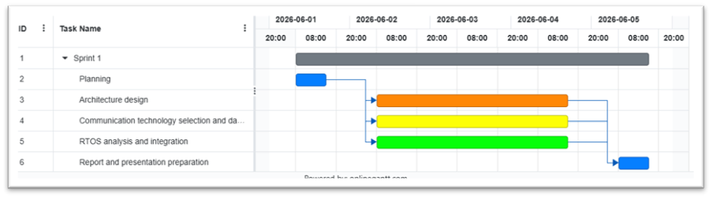

# Iduce - Sprint 1

Grupo 1 - Rodrigo Pinto, Rodrigo Bolelho, Martim Botelho

## Índice
1. [Introdução](#11-introdução)
2. [Planeamento do Sprint 1 (PMDEV)](#12-planeamento-do-sprint-1-pmdev)
3. [Design de Arquitetura (VEVCA)](#13-design-de-arquitetura-vevca)
4. [Real-Time Operating System (RTOS) Design and Selection (RTOPR)](#14-real-time-operating-system-rtos-design-and-selection-rtopr)
5. [Tecnologias de Comunicação (SYOSY)](#15-tecnologias-de-comunicação-syosy)
6. [Conclusão](#16-conclusão)

## 1.1. Introdução
Este documento apresenta a análise e o planeamento para a implementação de um sistema de gestão de pelotão de veículos autónomos no contexto da unicade curricular de IDUCE (Engenharia de Casos de Uso Focados na Indústria). Este projeto foca-se na definição da arquitetura do sistema, na escolha do Sistema Operativo de Tempo Real (RTOS) e das tecnologias de comunicação a utilizar. O objetivo é criar um sistema robusto e eficiente que permita a coordenação eficaz entre os veículos do pelotão, garantindo a segurança e a fiabilidade das operações.

## 1.2 Planeamento do Sprint 1 (PMDEV)

O planeamento do sprint 1 foi feito no primeiro dia do sprint, e teve como resultado o seguinte plano de atividades:

Os principais marcos do sprint 1 incluem:
- Construção do design de arquiterura;
- Estudo, análise e escolha do RTOS a utilizar e das suas funcionalidades chave;
- Estuda, análise e escolha das tecnologias de comunicação a utilizar;

## 1.3 Design de Arquitetura (VEVCA)

## 1.4 Real-Time Operating System (RTOS) Design and Selection (RTOPR)

Esta secção detalha a seleção e as diretrizes de configuração do Sistema Operativo de Tempo Real (RTOS) responsável por gerir a Unidade de Controlo Eletrónico (ECU) dedicada exclusivamente à Gestão do Pelotão (*Platoon Management*).

O objetivo é assegurar o determinismo e a fiabilidade na execução das tarefas de coordenação, manutenção preditiva e comunicação inter-veicular, isolando estas operações da ECU central de controlo do veículo (*Vehicle Control*).

## 1.4.1. Avaliação Comparativa de RTOS

A seleção do sistema operativo de tempo real (RTOS) para a ECU de Gestão do Pelotão exigiu uma análise que foi além da simples disponibilidade ou facilidade de utilização. Sendo esta ECU responsável pela agregação de dados provenientes de múltiplos veículos, pela gestão das comunicações de rede e pela transmissão de informação consolidada para a ECU de controlo, o RTOS escolhido deve garantir previsibilidade temporal, fiabilidade e capacidade de evolução futura.

Foram analisadas três soluções representativas de diferentes abordagens ao desenvolvimento de sistemas embebidos críticos: FreeRTOS, AUTOSAR OS e QNX Neutrino.

O QNX Neutrino representa, do ponto de vista técnico, a solução mais robusta entre as alternativas consideradas. A sua arquitetura baseada em microkernel permite isolar componentes críticos do sistema, reduzindo significativamente a propagação de falhas. Em caso de erro numa aplicação, o restante sistema pode continuar operacional, uma característica particularmente valorizada em sistemas automóveis de elevada criticidade. Além disso, o QNX possui certificações amplamente reconhecidas para aplicações de segurança funcional e é utilizado em diversos sistemas automóveis comerciais.

Contudo, estas vantagens têm um custo significativo. O licenciamento comercial, os requisitos de hardware superiores e a maior complexidade de desenvolvimento tornam a sua utilização pouco adequada para um projeto como estes, cujo principal objetivo é validar a arquitetura proposta.

O AUTOSAR OS encontra-se no extremo oposto em termos de adoção industrial. Oferece integração com ecossistemas completos de desenvolvimento automóvel e facilita a conformidade com processos de segurança funcional. No entanto, a sua natureza fortemente configurada e estática implica uma curva de aprendizagem elevada e um esforço considerável de integração, incompatíveis com os recursos disponíveis.

Face a estas alternativas, o FreeRTOS surge como a solução de melhor compromisso entre desempenho, simplicidade e flexibilidade. Apesar de não oferecer o mesmo nível de isolamento de falhas do QNX nem a integração automóvel do AUTOSAR, disponibiliza todos os mecanismos fundamentais necessários para o sistema proposto, incluindo escalonamento preemptivo, gestão eficiente de tarefas, sincronização através de semáforos e mecanismos de comunicação inter-processos.

Outro fator determinante foi a escalabilidade da plataforma. Embora a arquitetura inicial utilize um processador single-core, o FreeRTOS suporta igualmente arquiteturas multi-core através da sua variante SMP (*Symmetric Multiprocessing*), permitindo uma futura evolução do sistema sem necessidade de substituição do RTOS.

Assim, embora o QNX represente a opção tecnicamente mais segura e o AUTOSAR a opção mais alinhada com os padrões industriais automóveis, o FreeRTOS foi considerado a escolha mais adequada para os objetivos deste projeto, oferecendo um equilíbrio favorável entre capacidade técnica, flexibilidade, custo e esforço de implementação.

## Comparação de RTOS

| Critério                            | FreeRTOS                           | AUTOSAR OS    | QNX Neutrino            |
| ----------------------------------- | ---------------------------------- | ------------- | ----------------------- |
| **Determinismo temporal**           | Elevado                            | Muito elevado | Muito elevado           |
| **Segurança funcional**             | Limitada (sem certificação nativa) | Muito elevada | Muito elevada           |
| **Isolamento de falhas**            | Reduzido (kernel monolítico)       | Moderado      | Excelente (microkernel) |
| **Suporte multicore**               | Sim (SMP)                          | Sim           | Sim                     |
| **Complexidade de desenvolvimento** | Baixa                              | Muito elevada | Elevada                 |
| **Requisitos de hardware**          | Muito reduzidos                    | Moderados     | Elevados                |
| **Custos de licenciamento**         | Gratuito                           | Elevados      | Elevados                |

## Resumo da decisão

Embora o QNX Neutrino apresente a arquitetura mais robusta e segura para sistemas automóveis críticos, os benefícios adicionais não justificam o aumento substancial de custo, complexidade e requisitos computacionais para o contexto deste projeto. Por sua vez, o AUTOSAR OS oferece uma forte integração com os processos industriais automóveis, mas a sua complexidade torna-o excessivamente pesado para um protótipo académico.

Outro motivo relevante para a escolha do FreeRTOS é o facto dos elementos deste grupo de trabalho terem forte interesse na aprendizagem deste OS e na sua aplicação em sistemas embebidos, o que torna a sua utilização particularmente adequada para um projeto académico como este.

Desta forma, o FreeRTOS foi selecionado como a solução que melhor satisfaz os requisitos funcionais da ECU de Gestão do Pelotão, garantindo previsibilidade temporal, facilidade de desenvolvimento, reduzidos requisitos de hardware e potencial de escalabilidade futura.

## 1.4.2. Funcionalidades Chave do RTOS Aplicadas à Gestão do Pelotão

Para dar resposta aos desafios de agregação de dados e gestão de rede, o sistema fará uso das seguintes mecânicas do FreeRTOS:

### Políticas de Escalonamento (*Scheduling*)

Implementação de um escalonamento preemptivo baseado em prioridades fixas.

A receção de dados de emergência de outros veículos via COMM e a sua passagem pelo PlatMgmt terão as prioridades mais elevadas, interrompendo tarefas computacionalmente mais pesadas mas menos críticas (por exemplo, modelos de PredMaint) quando necessário.

### Comunicação Inter-Processos (IPC)

#### Filas de Mensagens (*Message Queues*)

Utilizadas para a passagem assíncrona de pacotes de dados recebidos da rede (tarefa COMM) para a tarefa de PlatMgmt.

Permitem lidar com picos de tráfego na rede (*bursts*) sem bloquear a execução de outras tarefas.

### Sincronização e Gestão de Concorrência

#### Mutexes com Herança de Prioridade (*Priority Inheritance*)

Aplicados no acesso a estruturas de dados globais, como a tabela que guarda a visão atualizada da velocidade e posição de todos os membros do pelotão.

Este mecanismo garante que uma tarefa crítica não fica bloqueada enquanto uma tarefa de baixa prioridade atualiza o estado de manutenção de um seguidor.

O modelo de prioridades fixas do FreeRTOS é particularmente adequado porque a criticidade das tarefas é conhecida à partida e não varia durante a execução do sistema.

## 1.5 Tecnologias de Comunicação (SYOSY)

## 1.6. Conclusão

O sprint 1 foi focado na definição do design de arquitetura do sistema, na escolha do RTOS a utilizar e das suas funcionalidades chave, e na escolha das tecnologias de comunicação a utilizar. O sprint 2 será focado na continuação do trabalho realizado no sprint 1.

