# Verificação e Validação de Aplicações Críticas (VEVCA)

## Diagrama de Arquitetura

O diagrama apresenta a arquitetura proposta para o sistema de monitorização de platooning. A arquitetura representa os principais subsistemas do veículo, os sensores e atuadores físicos, e as interfaces usadas para trocar informação entre os componentes de software.

O diagrama segue a matriz de feeds definida no enunciado. Os sensores não comunicam diretamente com os módulos de decisão; em vez disso, cada sensor é ligado a um adapter específico, responsável por converter os dados do dispositivo para uma ontologia. Estes dados são depois expostos através de interfaces comuns, como Perception Interface, Position Interface, Wheel Motion Interface, Steering Interface e Health Interface.

As cores do diagrama representam a alocação lógica dos componentes pelas ECUs. Assim, o mesmo diagrama mostra simultaneamente os fluxos entre sensores, interfaces, módulos e atuadores, e a distribuição proposta dos componentes pelas unidades computacionais do veículo.

A separação entre Device Adapters e Common Interfaces foi introduzida para reduzir o acoplamento entre hardware e software. Estes elementos representam abstrações lógicas da arquitetura, não componentes físicos obrigatórios. Na implementação, podem estar integrados no firmware do sensor, numa ECU local ou na ECU principal, dependendo do tipo de sensor e da distribuição escolhida.

Assim, módulos como Vehicle Control, Navigation, Communication e Predictive Maintenance não dependem diretamente do formato específico de cada sensor. Por exemplo, os dados das câmaras, LiDAR e sensores ultrassónicos são normalizados através da Perception Interface antes de serem consumidos pelo Vehicle Control.

O Vehicle Control é responsável pelas decisões de curto prazo, como acelerar, travar ou virar, e envia comandos para os atuadores de Steering, Braking e Powertrain. A Navigation fornece informação de rota ao Vehicle Control. O Platoon Management mantém a visão do estado do platoon e fornece decisões de nível superior ao Vehicle Control. O Predictive Maintenance monitoriza o estado do veículo e, dependendo do papel do veículo, comunica os seus resultados ao Platoon Management, quando o veículo atua como leader, ou ao Communication, quando o veículo atua como follower.

No caso dos followers, uma potencial avaria detetada pelo PredMaint é enviada através do COMM para o veículo leader. No leader, o COMM encaminha a informação recebida para o PlatMgmt, que atualiza a visão global do platoon. Caso seja necessário encostar à berma, o PlatMgmt influencia o VC do leader, e os followers continuam a replicar a trajetória do leader de acordo com o comportamento de platooning.

### Alocação Hardware/Software por ECU

| ECU | Nome | Componentes |
| --- | --- | --- |
| ECU 1 | Perception ECU | Cameras, LiDAR, Ultrasonic Sensors, respetivos adapters, Perception Interface |
| ECU 2 | Localization, Motion & Navigation ECU | GPS, Wheel Speed Sensor, Steering Sensor, respetivos adapters, Position Interface, Wheel Motion Interface, Steering Interface, NAV |
| ECU 3 | Health & Diagnostics ECU | Tyre Pressure Sensors, Engine Temperature Sensors, Brake Status Sensors, respetivos adapters, Health Interface |
| ECU 4 | Predictive Maintenance ECU | PredMaint |
| ECU 5 | Vehicle Control ECU | VC |
| ECU 6 | Communication ECU | COMM |
| ECU 7 | Platoon Management ECU | PlatMgmt - active on leader |
| ECU 8 | Steering ECU | Steering |
| ECU 9 | Braking ECU | Braking |
| ECU 10 | Powertrain ECU | Powertrain |

### Justificação da alocação por ECUs

A alocação dos componentes pelas ECUs foi definida com base nas responsabilidades, criticidade temporal e isolamento de falhas. Esta separação permite distribuir o processamento pelo veículo sem acoplar todos os sensores, módulos de decisão e atuadores numa única ECU.

- **ECU 1 - Perception ECU**  
  Agrupa os sensores responsáveis pela perceção do ambiente, nomeadamente câmaras, LiDAR e sensores ultrassónicos. Estes sensores têm uma responsabilidade funcional semelhante e produzem dados usados para construir a representação do mundo envolvente do veículo. A sua alocação conjunta simplifica o processamento inicial de perceção e a exposição de dados através da Perception Interface.

- **ECU 2 - Localization, Motion & Navigation ECU**  
  Agrega os sensores relacionados com localização e movimento, como GPS, wheel speed sensor e steering sensor. O módulo NAV também é colocado nesta ECU porque depende diretamente destes dados para calcular e atualizar a rota. Esta separação permite concentrar dados cinemáticos e de posicionamento numa unidade funcionalmente coerente.

- **ECU 3 - Health & Diagnostics ECU**  
  Concentra os sensores associados ao estado físico do veículo, como tyre pressure, engine temperature e brake status. Esta ECU tem como responsabilidade recolher e normalizar dados de diagnóstico, disponibilizando-os posteriormente através da Health Interface.

- **ECU 4 - Predictive Maintenance ECU**  
  Executa o PredMaint numa ECU dedicada porque este módulo pode envolver processamento computacionalmente mais pesado, incluindo análise de tendências, correlação entre sensores, previsão de falhas e possível modelação baseada em digital twins. A separação evita que este processamento interfira com tarefas de controlo em tempo-real.

- **ECU 5 - Vehicle Control ECU**  
  Isola o VC numa ECU dedicada por ser o núcleo crítico do sistema de controlo. Este módulo executa decisões de curto prazo, como acelerar, travar e virar, com requisitos temporais mais exigentes. A sua separação reduz interferência de outros módulos e facilita uma política de escalonamento mais determinística.

- **ECU 6 - Communication ECU**  
  Contém o COMM, responsável pela comunicação entre veículos do platoon. Esta separação isola o tráfego de comunicação externa dos módulos de controlo e permite gerir receção, envio e validação de mensagens de estado de forma independente.

- **ECU 7 - Platoon Management ECU**  
  Contém o PlatMgmt, responsável por manter a visão atualizada do platoon e agregar informação recebida através do COMM. Embora o componente possa existir em todos os veículos, a sua função principal fica ativa no veículo que assume o papel de leader.

- **ECU 8/9/10 - Actuator ECUs**  
  Steering, Braking e Powertrain foram colocados em ECUs dedicadas por serem atuadores críticos para o veículo. Esta separação permite maior modularidade e isolamento de falhas, evitando que uma falha num atuador afete diretamente os restantes.
