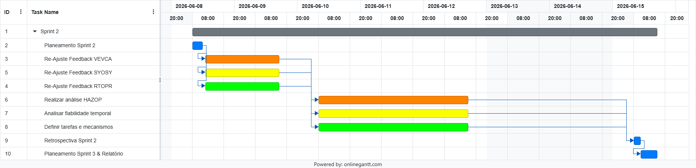
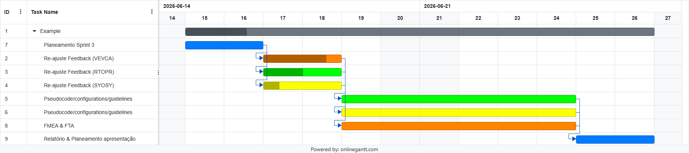
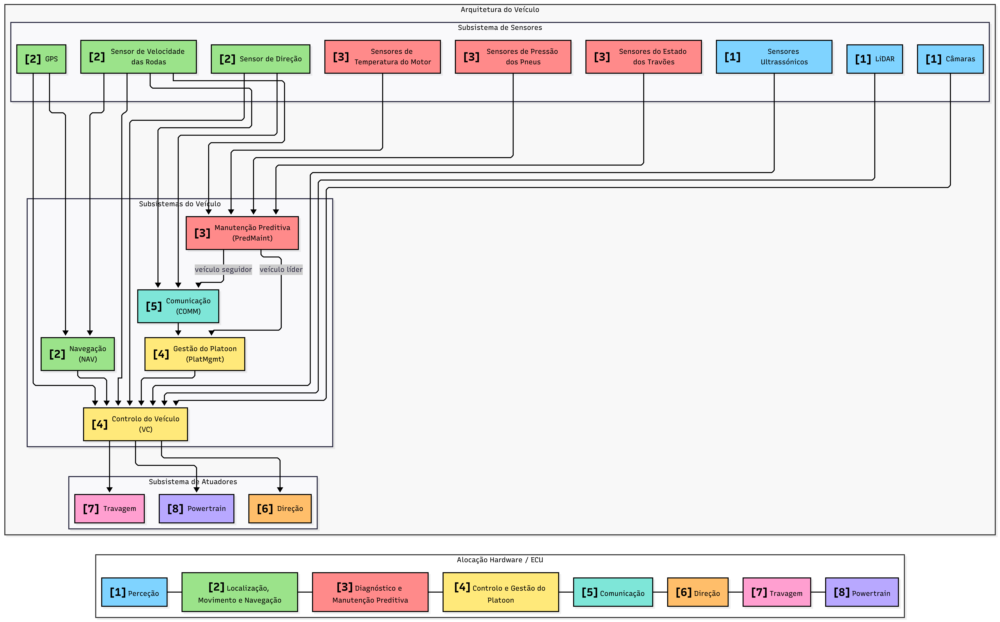
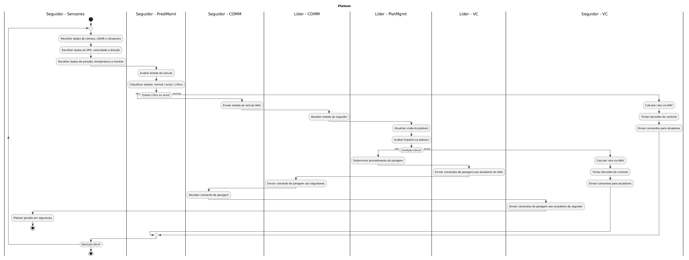

# Sprint 2 - IDUCE - Platoon Monitoring

Grupo 1 - Rodrigo Pinto, Rodrigo Bolelho, Martim Botelho

## Índice

- [Preâmbulo](#preâmbulo)
- [1. PMDEV](#1-pmdev)
- [2. VEVCA](#2-vevca)
- [3. RTOPR](#3-rtopr)
- [4. SYOSY](#4-syosy)
- [5. Referências](#5-referências)

    

## Preâmbulo

O Platoon Monitoring é um sistema de monitorização para veículos autónomos em platoon. O veículo líder mantém uma visão atualizada do estado de todos os veículos e, ao identificar uma potencial avaria, coordena a manobra de paragem segura na berma da estrada. Cada veículo é composto por sensores, atuadores e um conjunto de módulos de controlo (VC, NAV, PredMaint, PlatMgmt e COMM) que comunicam entre si e com os restantes veículos do platoon.

## 1. PMDEV 

### 1.1 Sprint 1 - Retrospectiva

O Sprint 1 estabeleceu as bases tecnológicas para o sistema de monitorização de *platooning*, centrando-se no design da arquitetura, na seleção do RTOS e na definição das tecnologias de comunicação.

**O que correu bem:**
- **Estratégia de Divisão de Tarefas:** A separação do trabalho por áreas de foco (Arquitetura, RTOS e Comunicação) permitiu um foco mais profundo de cada elemento da equipa, resultando em entregas mais detalhadas e de qualidade superior.
- **Decisões Sólidas:** Concluiu-se a seleção do RTOS e das tecnologias de comunicação que garantirão a fiabilidade e eficiência essenciais ao sistema.

**Desafios e Pontos de Melhoria:**
- **Comunicação Transversal:** O elevado foco individual alertou para a necessidade de manter um canal de comunicação constante entre todos os elementos, garantindo que as peças do projeto encaixam e integram na perfeição.
- **Lacunas na Arquitetura:** Existiram dificuldades concretas no design inicial, nomeadamente na alocação dos componentes pelas ECUs e na falta da elaboração do diagrama de estados (*state machine*).

---

### 1.2 Sprint 2 - Planeamento 

O Sprint 2 arranca com um objetivo prioritário: o reajuste das três componentes principais do projeto (Arquitetura, RTOS e Comunicações). Tendo em conta as aprendizagens do Sprint 1, as iterações planeadas para a arquitetura exigirão uma reavaliação dos seus impactos no RTOS e nas tecnologias de comunicação. Este processo, a realizar logo no início do sprint, é fundamental para orientar as decisões posteriores e assegurar que a evolução do design do sistema se mantém coerente, robusta e alinhada com os objetivos globais.

Após esta consolidação inicial, o foco recairá sobre a segurança e a operação do sistema. Será conduzida uma análise HAZOP para identificar potenciais desvios e riscos, culminando na construção da respetiva tabela. Paralelamente, efetuar-se-á uma análise temporal das transferências de dados, com o intuito de avaliar a fiabilidade das comunicações e propor soluções de mitigação para eventuais falhas. No domínio do RTOS, o trabalho centrar-se-á na identificação das tarefas essenciais ao funcionamento do sistema, bem como na definição dos mecanismos de sincronização e das propriedades de escalonamento.

Por fim, o sprint encerrará com a elaboração de um relatório detalhado de progresso e com o planeamento das tarefas para o período 3, garantindo assim uma gestão eficaz e a continuidade fluida do trabalho da equipa.

Para visualização do planeamento deste sprint, apresentamos o seguinte diagrama de Gantt:

**Legenda: Laranja: Rodrigo Botelho | Amarelo: Martim Botelho | Verde: Rodrigo Pinto | Azul: Todos**

Através do gráfico é possível observar que foi mantida a estratégia do Sprint 1 de alocar cada módulo a um elemento específico da equipa, o que permitirá uma maior profundidade de análise e desenvolvimento em cada área. Todos os módulos começam com uma fase de revisão e reajuste em caso de necessidade, o que é fundamental para garantir que o trabalho realizado no sprint anterior é aproveitado e otimizado. Apesar de não estar formalizado no diagrama de Gantt, está previsto um *briefing* de alinhamento a meio do sprint, logo após a revisão da arquitetura, garantindo que as decisões tomadas nessa fase são bem comunicadas e integradas nas tarefas subsequentes.

---

### 1.3 Sprint 2 - Retrospectiva

O Sprint 2 destacou-se pela consolidação robusta do projeto. A fase de reajuste inicial cumpriu o seu propósito, permitindo corrigir as lacunas da arquitetura identificadas no sprint anterior e estabelecendo um design muito mais sólido e integrado com o RTOS e as Comunicações.

Em termos de segurança e fiabilidade, o trabalho traduziu-se em resultados práticos: a análise HAZOP forneceu uma matriz clara de mitigação de riscos, enquanto a análise temporal das transferências de dados resultou em soluções concretas que aumentam substancialmente a robustez da rede. Relativamente ao RTOS, a equipa conseguiu fechar um mapeamento claro das tarefas e dos mecanismos de sincronização, garantindo a escalabilidade do sistema.

A grande vitória deste sprint, contudo, foi a evolução na dinâmica da equipa. A comunicação transversal melhorou de forma significativa, colmatando o principal desafio do Sprint 1. O *briefing* intercalar provou ser uma excelente ferramenta, assegurando que as peças desenvolvidas individualmente encaixavam com precisão. Em suma, o Sprint 2 transformou os desafios iniciais numa boa base para o futuro do projeto.

---

### 1.4 Sprint 3 - Planeamento

O Sprint 3 tem como foco a concretização dos resultados obtidos no Sprint 2, com especial ênfase na análise de segurança e na operacionalização do sistema. A primeira etapa será a realização da Análise de Modos de Falha e Efeitos (FMEA), utilizando os resultados da análise HAZOP para identificar e classificar os modos de falha potenciais, bem como as suas consequências. Esta análise será complementada por uma Árvore de Falhas (FTA), que permitirá visualizar as relações entre os diferentes modos de falha e identificar os pontos críticos do sistema. Será também realizado o pseudocódigo e a configuração para a operacionalização do sistema de comunicações, garantindo que as soluções propostas no Sprint 2 são implementáveis e eficazes. Paralelamente, será desenvolvido o pseudocódigo e as diretrizes para a configuração do RTOS, assegurando que o sistema é capaz de suportar as tarefas identificadas e os mecanismos de sincronização definidos. O sprint culminará com a elaboração de um relatório detalhado de progresso, que documentará os resultados alcançados.

Para visualização do planeamento deste sprint, apresentamos o seguinte diagrama de Gantt:

**Legenda: Laranja: Rodrigo Botelho | Amarelo: Martim Botelho | Verde: Rodrigo Pinto | Azul: Todos**

## 2. VEVCA

### 2.1 Melhorias Sprint 1

#### Descrição dos componentes

- **Sensores** recolhem dados do ambiente e do estado físico do veículo - perceção (câmara, LiDAR, ultrassons), localização e movimento (GPS, velocidade, direção) e diagnóstico (pressão dos pneus, temperatura, travões).
- **NAV** recebe os dados de localização e movimento e calcula/atualiza a rota do veículo.
- **PredMaint** recebe os dados de diagnóstico e movimento, avalia o estado de saúde do veículo e classifica-o como normal, aviso ou crítico.
- **VC** é o núcleo de decisão de cada veículo. Recebe os dados de perceção, a rota do NAV, o estado do PredMaint e o estado do platoon, toma decisões de controlo de curto prazo e envia comandos para os atuadores (direção, travagem, powertrain).
- **COMM** gere a comunicação V2V. No seguidor, transmite o estado de saúde ao líder. No líder, partilha as decisões de manobra entre os seguidores.
- **PlatMgmt** mantém uma visão atualizada da posição, velocidade e estado de cada veículo do platoon, e quando deteta uma condição crítica, faz com que o platoon se encaminhe para a berma da estrada.

#### Fluxo de dados

| Origem | Dados | Destino |
| --- | --- | --- |
| Câmaras, LiDAR, ultrassons | Dados de perceção | VC |
| GPS | Localização | VC, NAV |
| Sensor de velocidade das rodas | Velocidade das rodas | VC, NAV, COMM, PredMaint |
| Sensor de direção | Ângulo de direção | VC, COMM |
| Sensores de pressão, temperatura e travões | Dados de diagnóstico | PredMaint |
| NAV | Rota calculada | VC |
| PredMaint | Classificação do estado do veículo | VC |
| PredMaint | Estado de saúde (aviso/crítico) | COMM (seguidor) |
| PredMaint | Estado de saúde (aviso/crítico) | PlatMgmt (líder) |
| COMM (seguidor) | Mensagem de estado V2V | COMM (líder) |
| COMM (líder) | Estado recebido dos seguidores | PlatMgmt |
| PlatMgmt | Decisão de manobra | VC (líder) |
| VC (líder) | Comando de manobra | COMM (líder) |
| COMM (líder) | Comando de manobra para os seguidores | COMM (seguidor) |
| COMM (seguidor) | Comando de manobra recebido | VC (seguidor) |
| VC | Comandos de direção, travagem, powertrain | Atuadores |

#### Requisitos

Os requisitos foram identificados e classificados em requisitos funcionais (F) e requisitos de qualidade (Q). Os requisitos funcionais descrevem comportamentos esperados do sistema, enquanto os requisitos de qualidade descrevem propriedades relevantes como desempenho, fiabilidade e isolamento de falhas.

| ID | Tipo | Texto |
| --- | --- | --- |
| F-01 | Funcional | O sistema deve recolher dados de câmaras, LiDAR e sensores ultrassónicos para suportar a perceção do ambiente envolvente do veículo. |
| F-02 | Funcional | O sistema deve recolher dados de GPS, velocidade das rodas e direção para representar o estado de localização e movimento do veículo. |
| F-03 | Funcional | O sistema deve recolher dados de pressão dos pneus, temperatura do motor e estado dos travões para monitorizar o estado físico do veículo. |
| F-04 | Funcional | O módulo NAV deve calcular ou atualizar a rota do veículo com base em dados de localização e movimento. |
| F-05 | Funcional | O módulo VC deve tomar decisões de curto prazo com base nos dados de perceção, localização, movimento, direção, rota e estado do platoon. |
| F-06 | Funcional | O módulo VC deve enviar comandos para os atuadores de direção, travagem e powertrain. |
| F-07 | Funcional | O módulo PredMaint deve avaliar o estado do veículo com base nos dados de diagnóstico e movimento. |
| F-08 | Funcional | O módulo PredMaint deve classificar o estado do veículo como normal, aviso ou crítico. |
| F-09 | Funcional | Quando um veículo seguidor detetar uma condição de aviso ou crítico, o sistema deve enviar essa informação ao veículo líder através do módulo COMM. |
| F-10 | Funcional | O módulo PlatMgmt deve manter uma visão atualizada da posição, direção, velocidade e estado de cada veículo do platoon. |
| F-11 | Funcional | Quando o PlatMgmt identificar uma condição crítica, deve decidir a interrupção da operação normal e enviar essa decisão ao VC do líder. |
| F-12 | Funcional | Quando a operação normal for interrompida pelo líder, o sistema deve comunicar essa decisão aos veículos seguidores através do módulo COMM. |
| F-13 | Funcional | Cada veículo seguidor deve executar a manobra recebida, ajustando direção, travagem e powertrain através do seu próprio VC. |
| Q-01 | Qualidade | O módulo VC deve executar decisões de curto prazo dentro da janela temporal definida para o controlo do veículo. |
| Q-02 | Qualidade | O sistema deve ignorar dados de sensores ou mensagens inter-veículo com timestamp expirado. |
| Q-03 | Qualidade | O sistema deve comparar os dados de sensores entre si para detetar valores incorretos e evitar que decisões sejam tomadas com base em leituras inválidas. |

#### Diagrama de arquitetura do sistema

#### Diagrama de atividades

### 2.2 HAZOP (Hazard and Operability Study)

Depois de ter o design do sistema quase fechado, realizámos um estudo HAZOP para identificar possíveis perigos e falhas no sistema. Este estudo tem como objetivo identificar desvios face ao comportamento esperado do sistema, analisar as suas causas e consequências, definir ações para controlar ou reduzir os riscos identificados, e garantir que esses problemas são registados e acompanhados ao longo do desenvolvimento.

#### Etapas do HAZOP

1. Dividir o sistema em secções para análise, como por exemplo, sensores, comunicação, controlo do veículo e atuadores.
1. Escolher o nó para o estudo, como por exemplo, o atuador de travagem.
1. Descrever a função do nó, como por exemplo, o atuador de travagem deve executar o comando enviado pelo VC para reduzir a velocidade ou parar o veículo.
1. Escolher um parâmetro para o nó, como por exemplo, o comando de travagem ou a força de travagem aplicada.
1. Escolher uma palavra-guia para o parâmetro, como por exemplo, "Não", "Errado" ou "Tarde".
1. Identificar o desvio resultante da combinação entre o parâmetro e a palavra-guia, como por exemplo, o comando de travagem não é executado.
1. Determinar as causas do desvio, como por exemplo, falha na ECU de travagem, falha de interface, avaria no atuador ou perda do comando enviado pelo VC.
1. Avaliar os problemas/consequências do desvio, como por exemplo, o veículo pode não conseguir reduzir a velocidade ou parar após uma avaria crítica.
1. Definir a ação recomendada (o que fazer, quando e quem).
1. Guardar a informação.
1. Repetir a partir do segundo passo.

#### Desvios identificados

Com base nos principais nós da arquitetura proposta, foram identificados alguns desvios relevantes para análise. Estes desvios incluem:

- H-01: Perda de dados de perceção provenientes das câmaras, LiDAR ou sensores ultrassónicos.
- H-02: Deteção incorreta de obstáculos ou limites da via pelo subsistema de perceção.
- H-03: Localização incorreta do veículo devido a erros de GPS ou posicionamento.
- H-04: Estimativa incorreta do estado de movimento do veículo devido a falhas nos sensores de velocidade das rodas ou direção.
- H-05: Falha do PredMaint na deteção de uma avaria do veículo.
- H-06: Classificação incorreta de uma avaria crítica como não crítica.
- H-07: Transmissão tardia do estado de avaria de um veículo seguidor para o veículo líder.
- H-08: Perda de comunicação entre veículos seguidores e o veículo líder.
- H-09: Estado incorreto do platoon mantido pelo PlatMgmt.
- H-10: Falha na execução de comandos de paragem ou controlo através da direção, travagem ou powertrain.

#### HAZOP - Palavras-guia

| Palavra-guia   | Significado                                          | Exemplo no sistema                                                      |
| -------------- | ---------------------------------------------------- | ----------------------------------------------------------------------- |
| Não            | A intenção de funcionamento não é cumprida           | O comando de travagem não é executado                                   |
| Mais           | Existe um aumento quantitativo num parâmetro         | A velocidade estimada é superior à velocidade real                      |
| Menos          | Existe uma diminuição quantitativa num parâmetro     | A força de travagem aplicada é inferior à necessária                    |
| Além de        | Ocorre uma atividade adicional não esperada          | O veículo envia uma mensagem duplicada ou adicional ao líder            |
| Parte de       | Apenas parte da intenção de funcionamento é cumprida | Apenas alguns sensores de perceção enviam dados válidos                 |
| Inverso        | Ocorre o oposto da intenção de funcionamento         | O atuador acelera quando deveria reduzir velocidade                     |
| Outro / Errado | Ocorre uma substituição ou interpretação incorreta   | A posição, estado ou severidade da avaria é interpretada incorretamente |
| Cedo           | A ação ocorre antes do momento correto               | O seguidor aplica uma manobra antes da decisão do líder                 |
| Tarde          | A ação ocorre depois do momento correto              | O estado de avaria do seguidor chega demasiado tarde ao líder           |

##### Análise HAZOP

| Nó/Função                       | Parâmetro                                        | Palavra-guia | Desvio                                                        | Possíveis causas                                                                                                 | Possíveis consequências                                                                     | Salvaguardas existentes/propostas                                                              | Recomendações                                                                                                                   | Responsável                                                                     |
| ------------------------------- | ------------------------------------------------ | ------------ | ------------------------------------------------------------- | ---------------------------------------------------------------------------------------------------------------- | ------------------------------------------------------------------------------------------- | ---------------------------------------------------------------------------------------------- | ------------------------------------------------------------------------------------------------------------------------------- | ------------------------------------------------------------------------------- |
| Sensores de perceção            | Dados de câmaras, LiDAR e sensores ultrassónicos | Não          | Sem dados de perceção disponíveis                             | Falha de sensor, câmara obstruída, falha do LiDAR, falha de cablagem, falha de entrada na ECU                    | O veículo pode não detetar obstáculos, limites da via ou veículos próximos                  | Verificação automática dos sensores e deteção de ausência de dados                             | Avisar o VC quando os dados de perceção não estiverem disponíveis e impedir decisões baseadas nesses dados                      | Engenheiro mecatrónico + Functional safety engineer                             |
| Processamento de perceção       | Objetos / limites da via detetados               | Errado       | Obstáculos ou limites da via são detetados incorretamente     | Mau tempo, ruído nos sensores, erro de calibração, falha no algoritmo de perceção                                | Decisão incorreta de trajetória, distância insegura entre veículos, possível colisão        | Comparação entre câmara, LiDAR e sensores ultrassónicos                                        | Confirmar objetos e limites da via com mais do que um sensor antes de enviar a informação ao VC                                 | Machine learning engineer + engenheiro mecatrónico                              |
| Localização                     | Posição do veículo                               | Errado       | A posição do veículo é estimada incorretamente                | Erro de GPS, perda de sinal, inconsistência com o mapa, falha no algoritmo de localização                        | Seguimento incorreto da trajetória ou estimativa incorreta da posição do veículo no platoon | Comparação entre GPS, velocidade das rodas e dados de movimento                                | Se a posição não for fiável, usar dados de movimento recentes e avisar o PlatMgmt                                               | Engenheiro de software + Planning/control engineer                              |
| Sensores de movimento           | Velocidade / ângulo de direção                   | Errado       | O estado de movimento do veículo é estimado incorretamente    | Falha no sensor de velocidade das rodas, falha no sensor de direção, erro de calibração, leituras desatualizadas | O VC pode calcular comandos inseguros de aceleração, travagem ou direção                    | Verificação de limites aceitáveis, timestamps e comparação com leituras anteriores             | Rejeitar medições fora dos valores esperados ou incoerentes com o estado anterior do veículo                                    | Engenheiro mecatrónico + Testing/validation engineer                            |
| Manutenção preditiva            | Estado de saúde do veículo                       | Não          | A avaria não é detetada                                       | Falha no PredMaint, falta de dados de diagnóstico, falha de sensor                                               | O veículo continua a operar com uma falha não detetada                                      | Verificações periódicas do estado do veículo                                                   | Verificar pressão dos pneus, temperatura do motor e estado dos travões em cada "ciclo" de monitorização                         | Machine learning engineer + Functional safety engineer                          |
| Manutenção preditiva | Severidade da avaria | Errado | Avaria crítica classificada como não crítica | Regra de classificação mal definida, falha no algoritmo, dados desatualizados, entrada incorreta de sensores | O platoon pode continuar a operar quando deveria parar | Verificação dos valores dos sensores e comparação com valores esperados | Quando os dados forem incertos ou incompletos, classificar a situação como mais grave e informar o líder | Functional safety engineer + tech lead |
| Comunicação seguidor-líder      | Tempo da mensagem de estado                      | Tarde        | O estado de avaria do seguidor chega demasiado tarde ao líder | Atraso na rede, perda de pacotes, congestionamento de comunicação, sobrecarga da ECU                             | O líder atualiza o estado do platoon tarde demais e pode atrasar a decisão de paragem       | Timestamps nas mensagens e deteção de atraso                                                   | Definir um tempo máximo para receber mensagens de avaria, se esse tempo for excedido, o líder deve assumir perda de informação  | Engenheiro de software + Testing/validation engineer                            |
| Comunicação seguidor-líder      | Mensagem de estado                               | Não          | A mensagem de estado do seguidor não é recebida pelo líder    | Falha de comunicação, falha da antena, perda de pacotes, falha da ECU de comunicação                             | O líder fica com uma visão incompleta do platoon e pode não reagir à avaria do seguidor     | Mensagens periódicas de presença, confirmação de receção (ACK) e reenvio de mensagens críticas | Se o líder deixar de receber mensagens de um seguidor, deve marcar esse veículo como não fiável e atualizar o estado do platoon | Engenheiro de software + engenheiro eletrotécnico                               |
| Gestão do platoon               | Visão do estado do platoon                       | Errado       | O líder mantém uma visão incorreta do platoon                 | Dados desatualizados, dados atribuídos ao veículo errado, erro de sincronização, mensagem corrompida             | O líder pode tomar uma decisão insegura ao nível do platoon                                 | Verificação de timestamps, origem das mensagens e coerência entre estados dos veículos         | Rejeitar mensagens antigas, corrompidas ou incoerentes antes de atualizar a visão do platoon                                    | Engenheiro de software + Functional safety engineer                             |
| Controlo do veículo / atuadores | Comando de paragem / controlo                    | Não          | O comando de paragem ou controlo não é executado              | Falha no VC, falha na ECU do atuador, falha de interface, falha na direção, travagem ou powertrain               | O veículo ou o platoon pode não conseguir parar após uma avaria crítica                     | Confirmação de comandos e feedback dos atuadores                                               | Exigir confirmação dos atuadores, se a confirmação não for recebida, o sistema deve repetir o comando e alertar o líder         | Planning/control engineer + engenheiro mecatrónico + Functional safety engineer |

As funções indicadas na coluna “Responsável” representam os perfis que ficariam encarregues de acompanhar, implementar ou validar as recomendações identificadas na análise HAZOP:

* **Engenheiro de software**: responsável pelo desenvolvimento da lógica dos módulos do sistema, incluindo comunicação, navegação, gestão do platoon e tratamento de mensagens entre veículos.

* **Engenheiro mecatrónico**: responsável pela integração entre sensores, atuadores e componentes físicos do veículo, garantindo que os dados recolhidos e as ações executadas correspondem ao comportamento esperado.

* **Engenheiro eletrotécnico**: responsável pelos componentes elétricos e eletrónicos do sistema, como ECUs, cablagem, alimentação, antenas e interfaces físicas de comunicação.

* **Machine learning engineer**: responsável por algoritmos baseados em dados, como apoio à perceção, deteção de padrões e classificação de estados ou falhas do veículo.

* **Planning/control engineer**: responsável por transformar a informação recebida dos sensores e dos módulos de decisão em ações de controlo, como direção, travagem, aceleração ou manobras.

* **Functional safety engineer**: responsável por analisar riscos, validar medidas de mitigação e garantir que o sistema reage de forma segura perante falhas críticas.

* **Testing/validation engineer**: responsável por definir e executar testes para verificar se sensores, módulos de software, comunicação e atuadores funcionam corretamente em cenários normais e de falha.

* **Tech lead**: responsável por coordenar as decisões técnicas, definir prioridades de implementação e garantir que as recomendações são acompanhadas pela equipa nas fases seguintes do projeto.

Com base nos desvios identificados e nas recomendações definidas, alguns requisitos existentes foram refinados e novos requisitos de qualidade foram adicionados para garantir que o sistema responde adequadamente às falhas identificadas.

## 3. RTOPR

### 3.1 Melhoramentos e Correções do Sprint 1

Na sequência da revisão dos resultados do Sprint 1, esta secção apresenta uma análise comparativa aprofundada dos Sistemas Operativos de Tempo Real (RTOS) avaliados para o sistema. O objetivo é fundamentar de forma rigorosa as classificações atribuídas, com especial foco nas garantias de determinismo temporal de cada tecnologia, suportando as decisões em especificações técnicas e literatura científica.
#### Tabela Comparativa de RTOS

| Critério | FreeRTOS | AUTOSAR OS | QNX Neutrino |
|-----------|----------|------------|--------------|
| Determinismo temporal | Elevado | Muito elevado | Muito elevado |
| Segurança funcional | Limitada (sem certificação nativa) | Muito elevada | Muito elevada |
| Isolamento de falhas | Reduzido (kernel plano/sem MPU ativa) | Moderado | Excelente (microkernel puro) |
| Suporte multicore | Sim (SMP) | Sim | Sim |
| Complexidade de desenvolvimento | Baixa | Muito elevada | Elevada |
| Requisitos de hardware | Muito reduzidos | Moderados | Elevados |
| Custos de licenciamento | Gratuito | Elevados | Elevados |

#### Justificação Científica e Técnica do Determinismo Temporal

O determinismo temporal define a capacidade de um sistema operativo de tempo real (RTOS) garantir matematicamente que uma tarefa responde a um evento e conclui a sua execução dentro de um limite máximo estrito de tempo, conhecido como **Worst-Case Execution Time (WCET)**.

As classificações apresentadas na Tabela 1 baseiam-se nos seguintes fundamentos técnicos e científicos.

#### 3.1.1. FreeRTOS (Determinismo: Elevado)

#### Fundamentação

O determinismo do FreeRTOS resulta do seu algoritmo de escalonamento preemptivo baseado em prioridades estritas. A latência de interrupção e o tempo de mudança de contexto (*context switch*) são previsíveis e determinísticos, permitindo respostas rápidas para a maioria das aplicações embebidas [9].

#### Limitações

O FreeRTOS é classificado como **Elevado**, e não como **Muito Elevado**, porque permite, por defeito, a criação dinâmica de tarefas e a alocação dinâmica de memória (*heap*) durante a execução.

Caso o sistema não seja configurado para utilizar exclusivamente recursos estáticos, podem surgir:

- Fragmentação de memória;
- Latências imprevisíveis;
- Variações no WCET.

Estas características reduzem o determinismo absoluto do sistema [10].

---

#### 3.1.2. AUTOSAR OS / OSEK (Determinismo: Muito Elevado)

#### Fundamentação

A arquitetura AUTOSAR OS, derivado diretamente do padrão OSEK/VDX, impõe uma configuração totalmente estática.

Todos os elementos do sistema devem ser definidos durante a compilação:

- Tarefas;
- Alarmes;
- Recursos;
- Prioridades;
- Eventos.

Não existe criação dinâmica de tarefas nem alocação dinâmica de memória durante a execução.

Esta abordagem elimina praticamente todas as fontes de indeterminação algorítmica no kernel, proporcionando um comportamento temporal altamente previsível [8].

#### Mecanismo de Proteção Temporal

O AUTOSAR OS deve incluir ainda o mecanismo de **Timing Protection**, responsável por monitorizar continuamente os tempos de execução das tarefas.

Este mecanismo permite:

- Detetar excessos de tempo de execução;
- Impedir que tarefas defeituosas monopolizem recursos;
- Garantir o cumprimento dos *deadlines* das tarefas críticas.

Esta funcionalidade constitui uma das principais razões para a utilização do AUTOSAR OS em sistemas automóveis com requisitos de segurança rigorosos.[7]

---

#### 3.1.3. QNX Neutrino (Determinismo: Muito Elevado)

##### Fundamentação

O QNX Neutrino adota uma arquitetura de microkernel puro baseada nas normas POSIX.

O núcleo executa apenas as funções essenciais:

- Escalonamento;
- Gestão de interrupções;
- Comunicação entre processos (*Inter-Process Communication – IPC*).

Todos os restantes serviços operam em user-space.

Esta separação reduz significativamente a complexidade do kernel e mantém as latências de interrupção na ordem dos microssegundos, mesmo sob cargas elevadas de processamento [11].

#### Adaptive Partitioning

O QNX reforça o seu comportamento determinístico através do mecanismo de **Adaptive Partitioning Scheduler (APS)**.

Este mecanismo:

- Divide o processador em partições temporais;
- Reserva percentagens mínimas de CPU para aplicações críticas;
- Impede a privação de recursos (*resource starvation*).

Assim, mesmo que uma aplicação não crítica falhe ou entre num ciclo infinito, as tarefas críticas continuam a receber o tempo de processamento necessário para cumprir os seus requisitos temporais [12].

---

#### Conclusão

Do ponto de vista do determinismo temporal, a arquiterura **AUTOSAR OS** e o **QNX Neutrino** apresentam desempenho superior ao **FreeRTOS**, uma vez que eliminam ou controlam rigorosamente as fontes de imprevisibilidade temporal.

O AUTOSAR OS alcança este resultado através de uma arquitetura totalmente estática e da proteção temporal integrada, enquanto o QNX Neutrino beneficia da sua arquitetura de microkernel e dos mecanismos de particionamento adaptável de CPU.

O FreeRTOS continua a constituir uma solução altamente eficiente para sistemas embebidos com recursos limitados, mas exige uma configuração cuidadosa para atingir níveis de determinismo comparáveis aos dos RTOS orientados para aplicações críticas de segurança. 

---

### 3.2 Identificação de Tarefas (PlatMgmt)

Para efeitos de escalonamento no FreeRTOS, os processos associados à Gestão do Pelotão foram divididos em tarefas independentes, separando claramente a receção, processamento e transmissão de dados.

- **Task_PlatMgmt_Update**: Tarefa central responsável por manter uma visão atualizada da posição, direção, velocidade e estado do veicúlo atual e dos outros membros do pelotão. Processa os dados recebidos para criar uma matriz de estado consolidada que será consumida pela tarefa de VC e Task_PlatMgmt_COMM_TX.

- **Task_PlatMgmt_COMM_RX**: Lida com a receção assíncrona de dados provenientes da rede (telemetria dos seguidores ou ordens do líder). Deixa os dados brutos preparados para a tarefa principal do PlatMgmt. 

- **Task_PlatMgmt_COMM_TX**: Lida com a transmissão síncrona de dados para a rede. No veículo líder, transmite as ordens de marcha ou decisões de paragem de emergência para os veículos seguidores. No veículo seguidor, transmite a telemetria atualizada para o líder.

- **Task_PredMaint_Leader**: Presente no veículo líder, monitoriza e agrega o estado dos subsistemas dos vários veículos para fins de manutenção preditiva, visando prever anomalias antes que estas ocorram. Deixa as decisões (caso existam) prontas a ler para serem comunicadas aos veiculos seguidores.

---

### 3.3 Identificação de Recursos Partilhados e Sincronização

A troca de dados entre as várias tarefas independentes exige mecanismos de sincronização robustos para evitar a corrupção de memória e garantir o determinismo temporal. No contexto do FreeRTOS, os recursos partilhados foram concebidos da seguinte forma.

#### 3.3.1 Estrutura de Estado do Pelotão (Recurso A)

Trata-se de uma estrutura de dados global que contém a matriz atualizada com a posição, velocidade, direção e estado operacional de cada veículo pertencente ao pelotão.

#### Mecanismo RTOS

Por permitir operações concorrentes de leitura e escrita sobre dados complexos, esta estrutura encontra-se protegida por um **Mutex**, utilizando o mecanismo de **Priority Inheritance** disponibilizado pelo FreeRTOS para evitar situações de inversão de prioridade.

#### Tarefas - Produtores e Consumidores

**Produtor:**

* `Task_PlatMgmt_Update` - responsável pela atualização contínua da informação do pelotão.

**Consumidores:**

* `Task_PredMaint_Leader` - consulta os dados para executar algoritmos de manutenção preditiva e deteção de anomalias.

---

#### 3.3.2 Fila de Mensagens de Receção (RX Message Queue) (Recurso B)

Esta fila é utilizada para armazenar temporariamente os pacotes recebidos através da rede de comunicações inter-veicular antes do respetivo processamento pela lógica de gestão do pelotão.

A sua principal função consiste em absorver variações temporárias na taxa de chegada das mensagens (*network jitter*), desacoplando a receção física da rede do processamento lógico da aplicação.

#### Mecanismo RTOS

A implementação utiliza uma **Message Queue** nativa do FreeRTOS.

Esta abordagem oferece:

* Sincronização automática entre tarefas;
* Operações de bloqueio seguras;
* Eliminação da necessidade de Mutexes adicionais para acesso à fila (thread-safe).

#### Tarefas - Produtores e Consumidores

**Produtores:**

* `Task_PlatMgmt_COMM_RX`;

**Consumidor:**

* `Task_PlatMgmt_Update`, que processa as mensagens segundo uma política FIFO (*First-In First-Out*).

---

#### 3.3.3 Fila de Mensagens de Transmissão (TX Message Queue) (Recurso C)  

Esta fila agrega todos os pacotes produzidos internamente que necessitam de ser transmitidos para a rede de comunicações do pelotão.

#### Mecanismo RTOS

A implementação utiliza igualmente uma **Message Queue** do FreeRTOS.

Esta solução suporta naturalmente o modelo:

* **Multiple Producers**
* **Single Consumer**

permitindo que várias tarefas submetam mensagens para transmissão sem comprometer a integridade dos dados.

#### Consumidor

A tarefa responsável pela leitura e envio das mensagens é:

* `Task_PlatMgmt_COMM_TX`

Esta tarefa remove sequencialmente os pacotes da fila e encaminha-os para a infraestrutura física de comunicação.

#### Produtores e Lógica de Papéis

O preenchimento da fila depende diretamente da função desempenhada pelo veículo dentro do pelotão.

##### Veículo Líder

No veículo líder, duas tarefas podem produzir mensagens para transmissão.

**Task_PlatMgmt_Update**

Responsável pelo envio periódico de:

* Comandos de sincronização;
* Velocidade de referência;
* Ordens de coordenação do pelotão;
* Informação operacional necessária aos veículos seguidores.

**Task_PredMaint_Leader**

Pode gerar mensagens assíncronas de elevada prioridade quando os algoritmos de manutenção preditiva identificam situações críticas.

Exemplos:

* Ordem de redução de velocidade;
* Solicitação de inspeção;
* Ordem de saída do pelotão;
* Comando de paragem de emergência devido à previsão de falha severa num veículo seguidor.

##### Veículo Seguidor

Nos veículos seguidores existe apenas um produtor para esta fila.

**Task_PlatMgmt_Update**

Esta tarefa recolhe e envia periodicamente:

* Telemetria local;
* Estado dos sensores;
* Estado dos atuadores;
* Diagnósticos dos subsistemas internos;
* Informação operacional necessária ao veículo líder para manter uma visão global do pelotão.

Desta forma, a arquitetura implementa um fluxo de informação hierárquico, no qual o líder distribui comandos operacionais e os seguidores reportam continuamente o seu estado, garantindo consistência, previsibilidade temporal e suporte à manutenção preditiva.

---

### 3.4 Propriedades de Escalonamento

O sistema utilizará um escalonamento preemptivo baseado em prioridades fixas, assumindo o algoritmo Rate Monotonic (RM), onde tarefas com menores períodos recebem maiores prioridades.

O planeamento temporal do PlatMgmt foi desenhado para alimentar atempadamente as decisões do VC, cujo ciclo de decisão varia entre 0.1s e 5s.

| Tarefa | Prioridade (RM) | Período (Ti) | Execução (Ci) | Prazo (Di) | Recurso Partilhado |
|--------|----------------|--------------|---------------|------------|---------------------|
| COMM_RX | Alta | 50 ms | 10 ms | 50 ms | B |
| Update | Média-Alta | 100 ms | 20 ms | 100 ms | A, B e C |
| COMM_TX | Média | 100 ms | 15 ms | 100 ms | C |
| Leader | Baixa | 1000 ms | 50 ms | 1000 ms | A e C |

**Justificação das Propriedades Temporais:**

- Assume-se um modelo de prazos implícitos (implicit deadlines), onde o prazo (Di) é igual ao período (Ti).
- A Task_PlatMgmt_Update opera com um período de 100 ms, garantindo que, no limite inferior do ciclo do VC (0.1s), a matriz de estado do pelotão contém dados recém-calculados.
- A Task_PlatMgmt_COMM_RX corre ao dobro da frequência (50 ms) para acomodar rapidamente as altas taxas de receção da telemetria, mitigando a perda de pacotes e reduzindo a latência no tratamento de emergências.
- A Task_PlatMgmt_COMM_TX tem um período de 100 ms, alinhado com o ciclo de decisão do VC, garantindo que as ordens de marcha ou telemetria são transmitidas a tempo de serem processadas.
- A Task_PredMaint_Leader, embora importante para a manutenção preditiva, tem um período mais longo (1000 ms) e prioridade mais baixa, pois as suas decisões não são críticas para o ciclo de atuação imediata do veículo.

---

### 3.5 Considerações sobre a Arquitetura de Hardware (Multi-Core)

É fundamental notar que esta análise de escalonabilidade assume a utilização de um processador de, pelo menos, dois núcleos (dual-core) na ECU. Nesta arquitetura, o Controlo do Veículo (VC) e a Gestão do Pelotão (PlatMgmt) partilham a mesma ECU, mas cada módulo é alocado a um núcleo dedicado (Core Affinity).  

Se ambos os módulos partilhassem o mesmo núcleo singular, a adição das tarefas críticas de VC à utilização de 60% do PlatMgmt faria com que a carga total do processador ultrapassasse facilmente os 100%, tornando o sistema impossível de escalonar. Uma solução teórica para contornar esta limitação num sistema de núcleo único seria duplicar os períodos de todas as tarefas do PlatMgmt, reduzindo a sua utilização isolada para 30%. No entanto, isso comprometeria inaceitavelmente a capacidade de resposta e o desempenho do pelotão em tempo real.  

Uma vez que a especificação detalhada e o escalonamento do taskset de VC estão fora do âmbito (out of scope) desta fase do projeto, a adoção da premissa de uma arquitetura dual-core assegura que o sistema se mantém matematicamente escalonável e garante um isolamento de desempenho robusto entre a atuação física do veículo e a coordenação do pelotão.

## 4 SYOSY 

A arquitetura do sistema exige que as restrições temporais (*deadlines*) sejam estritamente cumpridas para garantir a segurança do pelotão. O requisito fundamental da aplicação estabelece que a tomada de decisão a curto prazo do Controlo do Veículo (VC) opera num intervalo de **0,1 s a 5 s**. Consequentemente, o sistema deve garantir uma **latência end-to-end máxima inferior a 100 ms (0,1 s)** para ações de resposta imediata ou manobras críticas de emergência (ex.: encostar o pelotão à berma perante uma avaria detetada).

### 4.1 Ajustes e feedback do sprint 1

Em resposta ao feedback recebido no primeiro sprint, a arquitetura de comunicação inter-veículo (V2V) foi profundamente reestruturada para eliminar o ponto único de falha (Single Point of Failure) introduzido pela dependência de um Broker MQTT centralizado no veículo líder. Para satisfazer os rigorosos requisitos de segurança e tempo real críticos, a coordenação do pelotão transitou para a middleware descentralizada DDS (Data Distribution Service) operando sobre 5G PC5 Sidelink, tirando agora partido de políticas estritas de QoS (como Liveliness e Deadlines) e substituindo o overhead do formato JSON por uma serialização binária previsível. O uso de MQTT e JSON foi assim restrito de forma exclusiva ao canal V2N (Vehicle-to-Network), sendo agora utilizados apenas para o envio assíncrono de telemetria de manutenção preditiva não crítica para a Cloud, separando claramente o domínio de controlo de tempo real do domínio de gestão de retaguarda.

### 4.2 Latência no Domínio Intra-veículo (Caminho Crítico de Decisão)

Para ações imediatas locais, os dados fluem dos sensores para os atuadores através do módulo VC.

#### Sensores → ECU de Perceção → ECU VC

A utilização de **Automotive Ethernet** (ex.: 1000BASE-T1 a 1 Gbps) garante que o transporte de grandes volumes de dados densos (como vídeo de câmaras) não cria estrangulamentos na rede interna. A latência de transmissão de um pacote nesta rede com arquitetura baseada em **TSN (Time-Sensitive Networking)** situa-se confortavelmente na ordem dos sub-milissegundos, suportando os requisitos determinísticos da indústria automóvel [1].

#### Processamento RTOS (FreeRTOS)

A adoção de um escalonamento preemptivo baseado em prioridades garante o determinismo. O tempo de processamento da decisão de emergência sofre um atraso mínimo, visto que a tarefa de Controlo do Veículo pode interromper processos menos prioritários quase de imediato e com um *overhead* de troca de contexto irrisório imposto pelo núcleo do RTOS [2].

#### ECU VC → ECUs Atuadores (CAN Bus)

O barramento CAN opera a uma velocidade de **1 Mbps**. O *payload* máximo estruturado pelo VC para o CAN é de apenas **8 bytes**. Aplicando a fórmula matemática da transmissão com inserção de bits de enchimento (*bit-stuffing*), o tempo de transmissão física de uma trama de atuação no pior cenário (*worst-case response time*) é de exatamente **134 µs** [3]. O limiar inferior do *deadline* rígido de **100 ms** é assim cumprido com facilidade.

### 4.3 Latência no Domínio Inter-veículo Crítico (Caminho de Coordenação do Platoon)

O teste de *stress* temporal ocorre quando uma anomalia grave (ex.: problema de travões num seguidor) exige uma ação coordenada do pelotão. Para garantir fiabilidade militar, o sistema descarta a dependência de um *Broker MQTT* centralizado para o canal crítico **V2V (Vehicle-to-Vehicle)**.

#### Transmissão V2V Direta (5G NR-V2X PC5 Sidelink)

A comunicação inter-veículo assenta na interface **PC5 Sidelink do 5G**. Esta tecnologia permite a comunicação direta (*Device-to-Device*) sem necessitar da infraestrutura da rede celular, fornecendo latências ultra-baixas na ordem de **1 a 5 ms** exigidas para o *platooning* autónomo [4].

#### Middleware de Tempo Real (DDS)

Em vez do MQTT, a partilha crítica de estados utiliza a *middleware* **DDS (Data Distribution Service)**. Sendo um protocolo totalmente descentralizado (*brokerless*), elimina o ponto único de falha no veículo líder. O DDS liga diretamente ECUs publicadoras e subscritoras, otimizando o fluxo de dados em veículos autónomos cooperativos [5].

#### Serialização Binária

Para V2V crítico, o uso de JSON foi abandonado face ao seu *overhead* de processamento e tamanho de variável de alocação. O sistema implementa o formato de representação binária nativa do DDS (**CDR – Common Data Representation**), que assegura um tamanho fixo do pacote e um tempo de *parsing* absolutamente previsível.

#### Desempenho Global

A latência *end-to-end* (desde a deteção do problema no seguidor → 5G Sidelink → DDS → VC do Líder → Atuadores via CAN) decorre numa janela altamente previsível de **5 ms a 10 ms**, mitigando totalmente as preocupações de segurança temporal.

### 4.4 Telemetria Não Crítica (Manutenção Preditiva Cloud / Backend)

A modelação em JSON sobre o protocolo MQTT é mantida exclusivamente para o canal **V2N (Vehicle-to-Network)**. Os registos de manutenção preditiva de longo prazo são enviados assincronamente para a *Cloud* da empresa de frotas. Neste domínio, o peso do *parsing* do JSON e a arquitetura *publish-subscribe* centralizada do MQTT não afetam a dinâmica física do pelotão em estrada.

---

## 4.5 Análise de Fiabilidade, Segurança e Políticas de QoS

Num sistema de condução autónoma interdependente, a falha de comunicação ou a ausência de mecanismos de QoS granulares têm consequências catastróficas. A transição para o modelo DDS sobre 5G Sidelink resolve as limitações clássicas de topologias centralizadas.

### 4.5.1 Políticas de QoS no V2V Crítico e Deteção de Perdas

A coordenação do pelotão não depende de sessões persistentes em *brokers* opacos, sendo gerida ativamente por políticas explícitas de **Qualidade de Serviço (QoS)** nativas do DDS.

#### Garantias de Liveliness (Vivacidade)

A política **LIVELINESS** do DDS monitoriza ativamente a presença dos membros no barramento virtual. Se um veículo seguidor perder a ligação (por quebra do *link* rádio), o sistema do veículo líder aciona instantaneamente a manobra de segurança.

#### Garantias de Deadline

A política **DEADLINE** contratualiza uma taxa de atualização rigorosa. Se o seguidor falhar o envio da sua telemetria física dentro de uma janela de **50 ms**, a aplicação de Controlo do Veículo é alertada imediatamente via *callbacks*.

#### Prioridades de Transporte

A política **TRANSPORT_PRIORITY** garante que comandos de travagem de emergência antecedam hierarquicamente dados operacionais de menor urgência na interface rádio do 5G.

### 4.5.2 Segurança, Autenticação e Prevenção de Ataques V2X

A utilização do canal rádio aberto (5G Sidelink PC5) expõe a frota a riscos cibernéticos severos. A segurança lógica é reforçada a vários níveis.

#### Autenticação e PKI V2X

O sistema integra a infraestrutura de chaves públicas definida pela especificação **IEEE 1609.2** para segurança V2X. A rede exige a troca de certificados de pseudónimo, garantindo que apenas camiões assinados e autorizados criptograficamente possam interagir e emitir comandos no interior do pelotão [6].

#### Mecanismo Anti-Replay e Integridade

Para proteger o sistema contra ataques de repetição (*Replay Attacks*), onde um intruso capta um comando de travagem de emergência e o tenta retransmitir perigosamente mais tarde, todos os *payloads* no DDS incluem algoritmos de verificação associados a *timestamps* e numeração de sequência restrita. Qualquer mensagem submetida fora da janela temporal de "frescura" será silenciosamente descartada [6].

### 4.5.3 Fiabilidade Intra-veículo (CAN Bus)

No domínio intra-veículo, a fiabilidade foca-se sobretudo no ruído eletromagnético dos motores/inversores e na integridade dos cabos de cobre.

#### Validação de Integridade (CRC)

Cada comando no CAN inclui um **Checksum CRC-16** (Bytes 6 e 7 da trama). O ruído eletromagnético que inverta bits resulta invariavelmente numa falha do CRC, forçando a ECU atuadora a rejeitar a trama.

#### Alive Counters (Watchdog)

O byte 5 das tramas funciona como um contador de vida. Caso o microcontrolador de travagem detete uma estagnação deste contador (sinalizando que a ECU de Controlo Central parou de transmitir ou o barramento colapsou), o atuador transita isoladamente para um **Fail-Safe State** (*Estado de Falha Segura*), aplicando travagens graduais baseadas no último comando reconhecido.

---

# 5. Referências

**[1]** T. Steinbach, H. Zinner, M. Rost, e K. Wolf, *"Comparing Time-Triggered Ethernet with PEV in an automotive in-vehicle network architecture"*, Proceedings of the IEEE 8th International Workshop on Factory Communication Systems (WFCS), Nancy, França, 2010, pp. 25–28.

**[2]** A. M. da Silva, A. R. de Oliveira, e C. A. C. Marcon, *"Analysis of FreeRTOS Overheads on Periodic Tasks"*, Anais do XVII Workshop em Desempenho de Sistemas Computacionais e de Comunicação (WPerformance), Natal, Brasil, Sociedade Brasileira de Computação, 2018, pp. 219–232.

**[3]** K. Tindell, A. Burns, e A. J. Wellings, *"Calculating Controller Area Network (CAN) Message Response Times"*, Control Engineering Practice, vol. 3, n.º 8, Elsevier, 1995, pp. 1163–1169.

**[4]** A. Ali, W. Hamouda, e L. U. Khan, *"IEEE 802.11bd & 5G NR V2X: Evolution of Radio Access Technologies for V2X Communications"*, IEEE Access, vol. 7, 2019, pp. 143186–143198.

**[5]** L. H. Sampaio, T. C. de Brito, e S. R. L. Meira, *"Evaluating DDS and MQTT for real-time vehicular networks"*, Proceedings of the IEEE Intelligent Vehicles Symposium (IV), Changshu, China, 2018, pp. 1195–1200.

**[6]** W. Whyte, A. Weimerskirch, V. Kumar, e T. Hehn, *"A Security Credential Management System for V2X Communications"*, IEEE Transactions on Intelligent Transportation Systems, vol. 14, n.º 4, 2013, pp. 2096–2106.

**[7]** Lemieux, J. (2001). *Programming Embedded Systems in C and C++: OSEK/VDX Operating System Standard*. CRC Press.

**[8]** AUTOSAR. (2021). *Specification of Operating System (Release R21-11)*. AUTOSAR Standard Document.

**[9]** Barry, R. (2016). *Using the FreeRTOS Real Time Kernel: A Practical Guide*. Real Time Engineers Ltd.

**[10]** Amsel, M., et al. (2019). *Performance Evaluation and Overhead Analysis of Open-Source Real-Time Operating Systems for Critical Applications*. IEEE Transactions on Industrial Informatics.

**[11]** Hildebrand, D. (1992). *An Architectural Overview of QNX*. Proceedings of the USENIX Workshop on Micro-kernels and Other Kernel Architectures.

**[12]** QNX Software Systems. (2020). *QNX Neutrino RTOS Architecture Primer*. BlackBerry Guide Documentation.