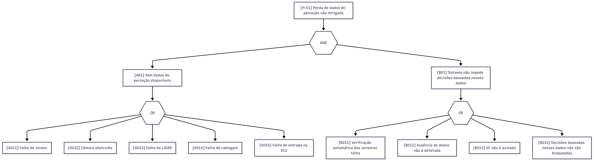
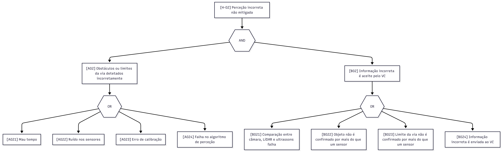
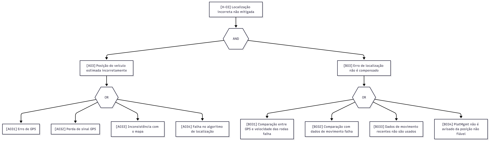
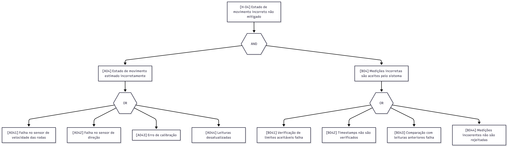
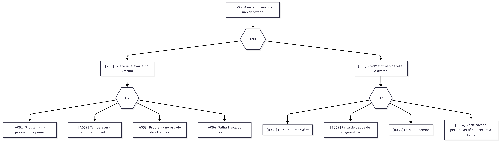
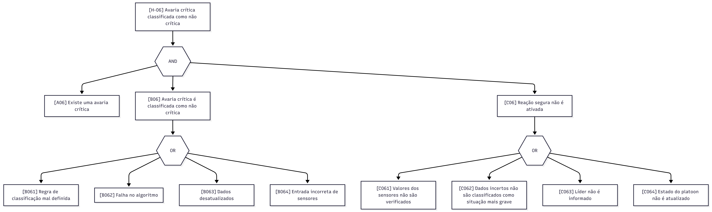
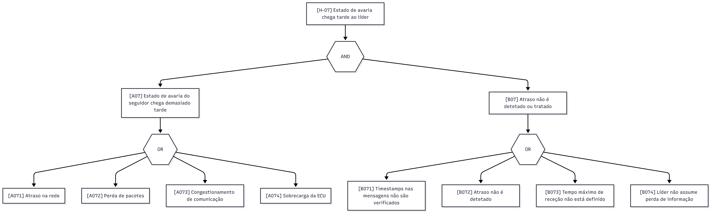
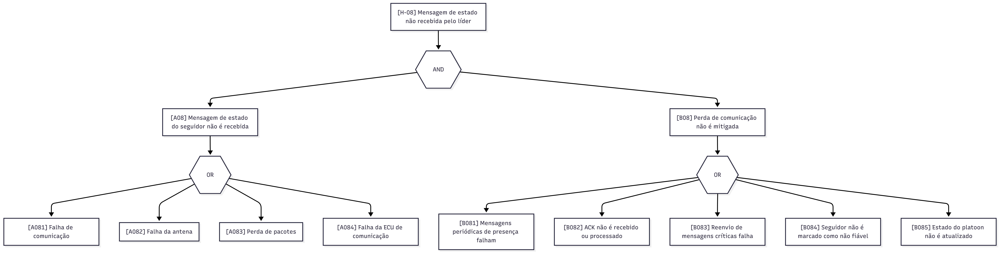
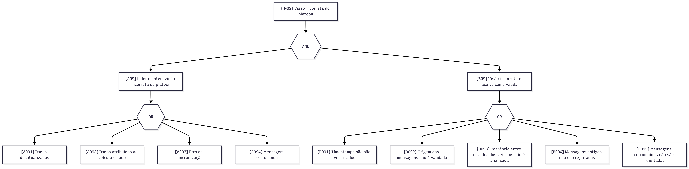
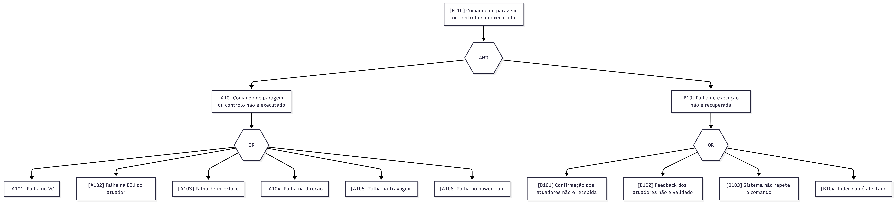

# Sprint 3 - IDUCE - Platoon Monitoring

Grupo 1 - Rodrigo Pinto, Rodrigo Botelho, Martim Botelho

# Índice

- [Preâmbulo](#preâmbulo)
- [1. PMDEV](#1-pmdev)
- [2. VEVCA](#2-vevca)
- [3. RTOPR](#3-rtopr)
- [4. SYOSY](#4-syosy)


# Preâmbulo

O Platoon Monitoring é um sistema de monitorização para veículos autónomos em platoon. O veículo líder mantém uma visão atualizada do estado de todos os veículos e, ao identificar uma potencial avaria, coordena a manobra de paragem na berma da estrada. Cada veículo é composto por sensores, atuadores e um conjunto de módulos de controlo (VC, NAV, PredMaint, PlatMgmt e COMM) que comunicam entre si e com os restantes veículos do platoon.

# 1. PMDEV

O Sprint 3 centrou-se na operacionalização do sistema, com especial atenção à segurança e à fiabilidade. A realização da Análise de Modos de Falha e Efeitos (FMEA) e da Árvore de Falhas (FTA) permitiu identificar e classificar os modos de falha potenciais, bem como as suas consequências, fornecendo uma visão clara dos pontos críticos do sistema. Esta análise foi fundamental para orientar as decisões subsequentes e garantir que o sistema é robusto e seguro.
Para além disto, o desenvolvimento do pseudocódigo e das configurações para a operacionalização do sistema de comunicações e do RTOS assegurou que as soluções propostas no Sprint 2 foram implementáveis e eficazes. O relatório detalhado de progresso documentou os resultados alcançados.
Neste sprint, para além da equipa ter conseguido atingir os objetivos técnicos, a equipa continuou a demonstrar uma excelente dinâmica de trabalho, com uma comunicação eficaz e uma colaboração estreita entre os elementos. A experiência adquirida nos sprints anteriores permitiu que a equipa abordasse os desafios com confiança e competência, resultando num progresso significativo e numa base sólida para o futuro do projeto.

A comunicação da equipa foi dividida entre 2 plataformas e áreas diferentes:
- **Discord**: Utilizado para comunicação rápida e informal, permitindo a troca de ideias e resolução de problemas em tempo real. Esta plataforma facilitou a interação diária entre os membros da equipa, promovendo um ambiente colaborativo e ágil.
- **Whatsapp**: Utilizado para comunicação mais formal e estruturada, permitindo a partilha de informações importantes, atualizações de progresso e decisões críticas. Esta plataforma assegurou que todos os membros da equipa estavam alinhados e informados sobre o estado do projeto.

Apesar de os memntos da equipa nem sempre conseguirem estar presentes em todas as aulas (devido ao estatuto de trabalhador-estudante), a equipa conseguiu manter uma comunicação eficaz e uma colaboração produtiva, garantindo que os objetivos do sprint foram alcançados com sucesso. A flexibilidade e a adaptabilidade da equipa foram fatores-chave para superar os desafios e manter o progresso constante do projeto.

# 2. VEVCA

Neste sprint, foi realizada a Árvore de Falhas (FTA) e a Análise de Modos de Falha e Efeitos (FMEA), com base nos resultados da análise HAZOP do sprint anterior. A FTA foi usada para representar, de forma top-down, como os desvios identificados podem contribuir para uma operação incorreta do platoon. De seguida, a FMEA foi usada para analisar esses modos de falha, identificando causas, efeitos, mecanismos de deteção, severidade, probabilidade, dificuldade de deteção, RPN e ações recomendadas.

## Fault Tree Analysis (FTA)

A FTA foi construída a partir dos dez desvios identificados no HAZOP. Para evitar uma árvore demasiado grande e difícil de interpretar, a análise foi dividida numa árvore geral e em dez subárvores, uma para cada desvio.

A árvore geral apresenta o Top Event, definido como operação incorreta do platoon. Como os desvios H-01 a H-10 estão ligados a este evento através de uma gate OR, qualquer um deles pode contribuir para uma operação incorreta caso não seja devidamente detetado ou mitigado.

Para esta análise, + representa um gate OR e . representa um gate AND. Assim, para a árvore geral:

Operação incorreta do platoon = H-01 + H-02 + H-03 + H-04 + H-05 + H-06 + H-07 + H-08 + H-09 + H-10

Os minimal cut sets da árvore geral são:

{H-01}, {H-02}, {H-03}, {H-04}, {H-05}, {H-06}, {H-07}, {H-08}, {H-09}, {H-10}

A expansão completa da árvore geral ao nível dos eventos básicos não é apresentada como uma única lista, porque seria demasiado complexa. Em vez disso, os minimal cut sets são apresentados separadamente em cada subárvore H-01 a H-10.

### H-01



H-01 = A01 . B01

A01 = A011 + A012 + A013 + A014 + A015

B01 = B011 + B012 + B013 + B014

H-01 = (A011 + A012 + A013 + A014 + A015) . (B011 + B012 + B013 + B014)

Minimal cut sets: {A011,B011}, {A011,B012}, {A011,B013}, {A011,B014}, {A012,B011}, {A012,B012}, {A012,B013}, {A012,B014}, {A013,B011}, {A013,B012}, {A013,B013}, {A013,B014}, {A014,B011}, {A014,B012}, {A014,B013}, {A014,B014}, {A015,B011}, {A015,B012}, {A015,B013}, {A015,B014}

### H-02



H-02 = A02 . B02

A02 = A021 + A022 + A023 + A024

B02 = B021 + B022 + B023 + B024

H-02 = (A021 + A022 + A023 + A024) . (B021 + B022 + B023 + B024)

Minimal cut sets: {A021,B021}, {A021,B022}, {A021,B023}, {A021,B024}, {A022,B021}, {A022,B022}, {A022,B023}, {A022,B024}, {A023,B021}, {A023,B022}, {A023,B023}, {A023,B024}, {A024,B021}, {A024,B022}, {A024,B023}, {A024,B024}

### H-03



H-03 = A03 . B03

A03 = A031 + A032 + A033 + A034

B03 = B031 + B032 + B033 + B034

H-03 = (A031 + A032 + A033 + A034) . (B031 + B032 + B033 + B034)

Minimal cut sets: {A031,B031}, {A031,B032}, {A031,B033}, {A031,B034}, {A032,B031}, {A032,B032}, {A032,B033}, {A032,B034}, {A033,B031}, {A033,B032}, {A033,B033}, {A033,B034}, {A034,B031}, {A034,B032}, {A034,B033}, {A034,B034}

### H-04



H-04 = A04 . B04

A04 = A041 + A042 + A043 + A044

B04 = B041 + B042 + B043 + B044

H-04 = (A041 + A042 + A043 + A044) . (B041 + B042 + B043 + B044)

Minimal cut sets: {A041,B041}, {A041,B042}, {A041,B043}, {A041,B044}, {A042,B041}, {A042,B042}, {A042,B043}, {A042,B044}, {A043,B041}, {A043,B042}, {A043,B043}, {A043,B044}, {A044,B041}, {A044,B042}, {A044,B043}, {A044,B044}

### H-05



H-05 = A05 . B05

A05 = A051 + A052 + A053 + A054

B05 = B051 + B052 + B053 + B054

H-05 = (A051 + A052 + A053 + A054) . (B051 + B052 + B053 + B054)

Minimal cut sets: {A051,B051}, {A051,B052}, {A051,B053}, {A051,B054}, {A052,B051}, {A052,B052}, {A052,B053}, {A052,B054}, {A053,B051}, {A053,B052}, {A053,B053}, {A053,B054}, {A054,B051}, {A054,B052}, {A054,B053}, {A054,B054}

### H-06



H-06 = A06 . B06 . C06

B06 = B061 + B062 + B063 + B064

C06 = C061 + C062 + C063 + C064

H-06 = A06 . (B061 + B062 + B063 + B064) . (C061 + C062 + C063 + C064)

Minimal cut sets: {A06,B061,C061}, {A06,B061,C062}, {A06,B061,C063}, {A06,B061,C064}, {A06,B062,C061}, {A06,B062,C062}, {A06,B062,C063}, {A06,B062,C064}, {A06,B063,C061}, {A06,B063,C062}, {A06,B063,C063}, {A06,B063,C064}, {A06,B064,C061}, {A06,B064,C062}, {A06,B064,C063}, {A06,B064,C064}

### H-07



H-07 = A07 . B07

A07 = A071 + A072 + A073 + A074

B07 = B071 + B072 + B073 + B074

H-07 = (A071 + A072 + A073 + A074) . (B071 + B072 + B073 + B074)

Minimal cut sets: {A071,B071}, {A071,B072}, {A071,B073}, {A071,B074}, {A072,B071}, {A072,B072}, {A072,B073}, {A072,B074}, {A073,B071}, {A073,B072}, {A073,B073}, {A073,B074}, {A074,B071}, {A074,B072}, {A074,B073}, {A074,B074}

### H-08



H-08 = A08 . B08

A08 = A081 + A082 + A083 + A084

B08 = B081 + B082 + B083 + B084 + B085

H-08 = (A081 + A082 + A083 + A084) . (B081 + B082 + B083 + B084 + B085)

Minimal cut sets: {A081,B081}, {A081,B082}, {A081,B083}, {A081,B084}, {A081,B085}, {A082,B081}, {A082,B082}, {A082,B083}, {A082,B084}, {A082,B085}, {A083,B081}, {A083,B082}, {A083,B083}, {A083,B084}, {A083,B085}, {A084,B081}, {A084,B082}, {A084,B083}, {A084,B084}, {A084,B085}

### H-09



H-09 = A09 . B09

A09 = A091 + A092 + A093 + A094

B09 = B091 + B092 + B093 + B094 + B095

H-09 = (A091 + A092 + A093 + A094) . (B091 + B092 + B093 + B094 + B095)

Minimal cut sets: {A091,B091}, {A091,B092}, {A091,B093}, {A091,B094}, {A091,B095}, {A092,B091}, {A092,B092}, {A092,B093}, {A092,B094}, {A092,B095}, {A093,B091}, {A093,B092}, {A093,B093}, {A093,B094}, {A093,B095}, {A094,B091}, {A094,B092}, {A094,B093}, {A094,B094}, {A094,B095}

### H-10



H-10 = A10 . B10

A10 = A101 + A102 + A103 + A104 + A105 + A106

B10 = B101 + B102 + B103 + B104

H-10 = (A101 + A102 + A103 + A104 + A105 + A106) . (B101 + B102 + B103 + B104)

Minimal cut sets: {A101,B101}, {A101,B102}, {A101,B103}, {A101,B104}, {A102,B101}, {A102,B102}, {A102,B103}, {A102,B104}, {A103,B101}, {A103,B102}, {A103,B103}, {A103,B104}, {A104,B101}, {A104,B102}, {A104,B103}, {A104,B104}, {A105,B101}, {A105,B102}, {A105,B103}, {A105,B104}, {A106,B101}, {A106,B102}, {A106,B103}, {A106,B104}

## Failure Mode and Effects Analysis (FMEA)

### Escalas usadas na FMEA

Como não existem dados reais de operação para o sistema, os valores de **Severidade**, **Probabilidade** e **Deteção** foram atribuídos de forma qualitativa, usando uma escala de 1 a 10.

O **RPN** é calculado por:

```text
RPN = Severidade × Probabilidade × Deteção
```

#### Escala de Severidade

| Valor | Classificação      | Descrição                                                                                       |
| ----: | ------------------ | ----------------------------------------------------------------------------------------------- |
|    10 | Perigosamente alta | A falha pode provocar colisão, perda de controlo ou impossibilidade de parar o veículo/platoon. |
|     9 | Extremamente alta  | A falha pode comprometer diretamente a segurança do platoon e exigir reação imediata.           |
|     8 | Muito alta         | A falha pode tornar o comportamento do veículo inseguro ou imprevisível.                        |
|     7 | Alta               | A falha pode causar degradação significativa da operação ou da coordenação do platoon.          |
|     6 | Moderada           | A falha pode afetar parcialmente a operação, mas ainda existe alguma capacidade de controlo.    |
|     5 | Baixa              | A falha reduz o desempenho do sistema, mas não causa imediatamente uma situação crítica.        |
|     4 | Muito baixa        | A falha pode ser compensada pelo sistema, com impacto limitado na operação.                     |
|     3 | Menor              | A falha causa apenas perturbações menores no funcionamento.                                     |
|     2 | Muito menor        | A falha tem impacto reduzido e facilmente controlável.                                          |
|     1 | Nenhuma            | A falha não tem impacto relevante na operação do sistema.                                       |

#### Escala de Probabilidade

| Valor | Classificação      | Descrição                                                  |
| ----: | ------------------ | ---------------------------------------------------------- |
|    10 | Quase certa        | A falha é esperada com muita frequência.                   |
|     9 | Muito alta         | A falha é muito provável em condições normais de operação. |
|     8 | Alta               | A falha pode ocorrer com alguma frequência.                |
|     7 | Moderadamente alta | A falha pode ocorrer em vários cenários operacionais.      |
|     6 | Moderada           | A falha pode ocorrer ocasionalmente.                       |
|     5 | Baixa              | A falha pode ocorrer, mas não é esperada com frequência.   |
|     4 | Muito baixa        | A falha é pouco provável.                                  |
|     3 | Remota             | A falha é improvável, mas possível.                        |
|     2 | Muito remota       | A falha é muito improvável.                                |
|     1 | Quase impossível   | A falha é extremamente improvável.                         |

#### Escala de Deteção

| Valor | Classificação      | Descrição                                                                           |
| ----: | ------------------ | ----------------------------------------------------------------------------------- |
|    10 | Incerta            | A falha dificilmente será detetada antes de afetar o sistema.                       |
|     9 | Muito remota       | A falha tem baixa probabilidade de ser detetada a tempo.                            |
|     8 | Remota             | A falha pode passar despercebida em vários cenários.                                |
|     7 | Muito baixa        | A deteção depende de verificações limitadas ou pouco frequentes.                    |
|     6 | Baixa              | A falha pode ser detetada, mas não de forma garantida.                              |
|     5 | Moderada           | Existem mecanismos de deteção, mas estes podem falhar em alguns casos.              |
|     4 | Moderadamente alta | A falha é normalmente detetada por verificações automáticas ou validações cruzadas. |
|     3 | Alta               | A falha tem grande probabilidade de ser detetada antes de causar impacto.           |
|     2 | Muito alta         | A falha é quase sempre detetada automaticamente.                                    |
|     1 | Quase certa        | A falha é detetada de forma praticamente imediata e fiável.                         |

A FMEA foi realizada com base nos eventos básicos identificados nas subárvores FTA. Cada linha corresponde a um modo de falha detalhado da árvore, mantendo a ligação entre os nós da FTA e a análise de risco.

A seguinte tabela apresenta uma seleção dos modos de falha com maior RPN, correspondendo aproximadamente ao top 20% dos eventos mais críticos identificados nas FTAs, a tabela completa encontra-se no Apêndice A.

| Componente                        | Modo de falha                                                        | Efeito                                                                                                    | Causa                                                                | Severidade | Probabilidade | Deteção | RPN | Ação recomendada                                                              |
| --------------------------------- | -------------------------------------------------------------------- | --------------------------------------------------------------------------------------------------------- | -------------------------------------------------------------------- | ---------- | ------------- | -------- | --- | ----------------------------------------------------------------------------- |
| Processamento de perceção         | [A021] Mau tempo                                              | Obstáculos ou limites da via podem ser detetados incorretamente | Chuva, nevoeiro ou baixa visibilidade                            | 10         | 5             | 5       | 250 | Validar perceção com sensores redundantes                    |
| Processamento de perceção         | [A024] Falha no algoritmo de perceção                         | Obstáculos podem ser classificados ou detetados incorretamente  | Erro de software, modelo ou caso não previsto                    | 10         | 4             | 6       | 240 | Testar o algoritmo com cenários variados                     |
| Processamento de perceção         | [A022] Ruído nos sensores                                     | Objetos podem ser detetados incorretamente                      | Interferência, leituras instáveis ou ruído externo               | 9          | 5             | 5       | 225 | Filtrar interferências e comparar sensores                   |
| PredMaint / política de segurança | [C062] Dados incertos não são classificados como mais graves  | Sistema pode continuar quando deveria parar                     | Política fail-safe inexistente                                   | 10         | 3             | 7       | 210 | Tratar incerteza como condição mais grave                    |
| PlatMgmt                          | [A091] Dados desatualizados                                   | Visão do platoon pode ficar incorreta                           | Mensagens antigas ou atraso de atualização                       | 10         | 4             | 5       | 200 | Rejeitar dados com timestamp expirado                        |
| Validação de sensores             | [B012] Ausência de dados não é detetada                       | VC pode usar dados inexistentes                                 | Timeout ou validação dos dados mal definida                      | 10         | 3             | 6       | 180 | Definir timeout e estado inválido para dados ausentes        |
| VC                                | [B014] Decisões com dados inválidos não são bloqueadas        | Comandos podem ser calculados com dados inválidos               | Falta de condição de bloqueio ou fallback no VC                  | 10         | 3             | 6       | 180 | Bloquear decisões quando a perceção estiver inválida         |
| Processamento de perceção         | [A023] Erro de calibração                                     | Posição de objetos ou limites da via pode ficar incorreta       | Calibração incorreta ou desvio após uso                          | 9          | 4             | 5       | 180 | Implementar validação periódica de calibração                |
| Validação de perceção             | [B021] Comparação entre sensores falha                        | Informação incorreta pode ser aceite                            | Erro na lógica de comparação de sensores                         | 10         | 3             | 6       | 180 | Validar a comparação entre sensores                          |
| VC                                | [B024] Informação incorreta é enviada ao VC                   | VC pode tomar uma decisão insegura                              | Falha no filtro antes do envio ao VC                             | 10         | 3             | 6       | 180 | Rejeitar dados inconsistentes antes do envio                 |
| VC / validação de movimento       | [B044] Medições incoerentes não são rejeitadas                | VC pode gerar comandos inseguros                                | Falta de regra de rejeição de incoerências                       | 10         | 3             | 6       | 180 | Rejeitar medições incoerentes antes do controlo              |
| PredMaint                         | [B061] Regra de classificação mal definida                    | Avaria crítica pode ser tratada como não crítica                | Critérios de severidade incorretos                               | 10         | 3             | 6       | 180 | Rever regras de classificação                                |
| PredMaint                         | [B062] Falha no algoritmo                                     | Classificação de severidade pode ficar errada                   | Erro de implementação ou caso não previsto                       | 10         | 3             | 6       | 180 | Testar algoritmo com casos críticos                          |
| COMM / líder                      | [C063] Líder não é informado                                  | Platoon pode não reagir à condição crítica                      | Falha de envio ou notificação ao líder                           | 10         | 3             | 6       | 180 | Informar o líder em qualquer condição crítica ou incerta     |
| PlatMgmt                          | [B084] Seguidor não é marcado como não fiável                 | Líder pode confiar num veículo sem comunicação                  | Falha na gestão de estado do seguidor                            | 10         | 3             | 6       | 180 | Marcar seguidor como não fiável após timeout                 |
| PlatMgmt / validação              | [B091] Timestamps não são verificados                          | Mensagens antigas podem ser aceites                             | Validação temporal ausente                                       | 10         | 3             | 6       | 180 | Verificar timestamps antes da atualização                    |
| Atuadores                         | [B101] Confirmação dos atuadores não é recebida               | Falha de execução pode não ser detetada                         | Mecanismo de confirmação ausente ou falha                        | 10         | 3             | 6       | 180 | Exigir confirmação após comandos críticos                    |

Os modos de falha com maior RPN concentram-se na perceção, validação de dados, classificação de avarias, comunicação com o líder e confirmação dos atuadores. Isto mostra que os principais riscos não resultam apenas das falhas técnicas iniciais, mas também da ausência de deteção ou validação perante essas falhas.

# 3. RTOPR

## 1. Recap técnico para configuração FreeRTOS

### Arquitetura assumida

| Core | Módulo |
|---|---|
| Core 0 | VC |
| Core 1 | PlatMgmt |

Apesar de neste sprint as tarefas implementadas sejam apenas as do `PlatMgmt`, a configuração considera uma ECU dual-core com FreeRTOS SMP. Desta forma, as tarefas do `PlatMgmt` são atribuídas ao `Core 1` através de core affinity, enquanto o `Core 0` fica disponível para uma futura implementação das tarefas do `VC`.

### Tarefas do PlatMgmt

| Tarefa | Prioridade | Período | Execução | Prazo | Recursos |
|---|---:|---:|---:|---:|---|
| `Task_PlatMgmt_COMM_RX` | Alta | 50 ms | 10 ms | 50 ms | B |
| `Task_PlatMgmt_Update` | Média-Alta | 100 ms | 20 ms | 100 ms | A, B, C |
| `Task_PlatMgmt_COMM_TX` | Média | 100 ms | 15 ms | 100 ms | C |
| `Task_PredMaint_Leader` | Baixa | 1000 ms | 50 ms | 1000 ms | A, C |

### Recursos partilhados

| ID | Recurso | Tipo FreeRTOS | Produtor(es) | Consumidor(es) |
|---|---|---|---|---|
| A | Estado do Pelotão / `PlatoonState` | Estrutura global + `Mutex` | `Task_PlatMgmt_Update` | `Task_PredMaint_Leader` |
| B | `RX_MessageQueue` | `Queue` | `Task_PlatMgmt_COMM_RX` | `Task_PlatMgmt_Update` |
| C | `TX_MessageQueue` | `Queue` | `Task_PlatMgmt_Update`, `Task_PredMaint_Leader` | `Task_PlatMgmt_COMM_TX` |

## 2. Configuração do FreeRTOS

A configuração do FreeRTOS foi definida no ficheiro `FreeRTOSConfig.h`, de acordo com a documentação oficial do FreeRTOS: [FreeRTOS Customization](https://www.freertos.org/Documentation/02-Kernel/03-Supported-devices/02-Customization).

Este ficheiro permite parametrizar o comportamento do kernel para a aplicação desenvolvida, sem alterar diretamente o código-fonte do FreeRTOS. Neste projeto, a configuração foi escolhida tendo em conta a utilização de escalonamento preemptivo, tarefas periódicas, sincronização entre tarefas e alocação estática de memória.

Para este projeto, foi considerada a seguinte configuração:

```c

#define configUSE_PREEMPTION 1 
#define configUSE_TIME_SLICING 0 
#define configTICK_RATE_HZ 1000 
#define configMAX_PRIORITIES 6 
#define configSUPPORT_STATIC_ALLOCATION 1 
#define configSUPPORT_DYNAMIC_ALLOCATION 0 
#define configUSE_MUTEXES 1 
#define configUSE_TICKLESS_IDLE 0 
#define configCHECK_FOR_STACK_OVERFLOW 2 
#define INCLUDE_vTaskDelayUntil 1 
#define INCLUDE_xTaskGetTickCount 1
#define configNUMBER_OF_CORES 2
#define configUSE_CORE_AFFINITY 1

```

| Parâmetro                          |    Valor | Função                                                                  | Aplicação no projeto                                                                                                                   |
| ---------------------------------- | -------: | ----------------------------------------------------------------------- | -------------------------------------------------------------------------------------------------------------------------------------- |
| `configUSE_PREEMPTION`             |      `1` | Ativa o escalonamento preemptivo.                                       | Permite que tarefas de maior prioridade interrompam tarefas menos prioritárias, garantindo resposta rápida da `Task_PlatMgmt_COMM_RX`. |
| `configUSE_TIME_SLICING`           |      `0` | Desativa a alternância automática entre tarefas com a mesma prioridade. | Torna o comportamento temporal mais previsível, uma vez que o sistema usa prioridades fixas e períodos bem definidos.                  |
| `configTICK_RATE_HZ`               |   `1000` | Define a frequência do tick do sistema.                                 | Garante uma resolução temporal de 1 ms, adequada para os períodos de 50 ms, 100 ms e 1000 ms.                                          |
| `configMAX_PRIORITIES`             |      `6` | Define o número máximo de níveis de prioridade disponíveis.             | Permite separar as tarefas do PlatMgmt por níveis de prioridade distintos.                                                             |
| `configSUPPORT_STATIC_ALLOCATION`  |      `1` | Permite a criação de recursos com alocação estática.                    | Suporta uma configuração mais determinística, com recursos definidos no arranque do sistema.                                           |
| `configSUPPORT_DYNAMIC_ALLOCATION` |      `0` | Desativa a alocação dinâmica de memória.                                | Evita fragmentação de memória e variações imprevisíveis no tempo de execução.                                                          |
| `configUSE_MUTEXES`                |      `1` | Ativa o uso de mutexes.                                                 | Permite proteger o acesso ao `PlatoonState`, evitando acessos concorrentes incorretos.                                                 |
| `configUSE_TICKLESS_IDLE`          |      `0` | Desativa o modo tickless idle.                                          | Mantém o tick periódico ativo, tornando a temporização do sistema mais previsível.                                                     |
| `configCHECK_FOR_STACK_OVERFLOW`   |      `2` | Ativa a verificação de overflow da stack.                               | Ajuda a detetar falhas de configuração ou consumo excessivo de stack pelas tarefas.                                                    |
| `INCLUDE_vTaskDelayUntil`          |      `1` | Disponibiliza a função `vTaskDelayUntil()`.                             | Necessário para implementar tarefas periódicas com períodos fixos.                                                                  |
| `INCLUDE_xTaskGetTickCount`        |      `1` | Disponibiliza a função `xTaskGetTickCount()`.                           | Permite obter o tempo atual do sistema em ticks, útil para controlo temporal e timestamps internos.                                    |
| `configNUMBER_OF_CORES`             |      `2` | Define o número de cores disponíveis no sistema.                        | Permite configurar o FreeRTOS para suportar a execução em múltiplos núcleos, com tarefas atribuídas a cores específicas.              |
| `configUSE_CORE_AFFINITY`          |      `1` | Ativa a afinidade de tarefas a cores específicos.                       | Permite associar as tarefas do `PlatMgmt` ao `Core 1`, deixando o `Core 0` disponível para uma futura implementação das tarefas do `VC`.                                   |

Como a alocação dinâmica está desativada, os recursos RTOS são criados estaticamente durante a inicialização, antes do arranque do escalonador.

## 3. Pseudo-código

Esta secção apresenta o pseudo-código operacional do suporte RTOS previsto para o módulo `PlatMgmt`. O objetivo é mostrar como as tarefas usam as primitivas principais do FreeRTOS para criar recursos, comunicar através de filas de mensagens, proteger recursos partilhados com mutexes e manter uma execução periódica.

---

### 3.1 Parâmetros usados no pseudo-código

Antes da criação dos recursos e das tarefas, são definidos os principais parâmetros usados pelo pseudo-código. Estes valores incluem o tamanho das filas, o tamanho das stacks, as prioridades das tarefas, os períodos de execução e os parâmetros de afinidade aos cores usados durante a operação.

Os valores apresentados correspondem a uma configuração inicial coerente com a análise temporal definida anteriormente. Numa implementação real, estes valores deveriam ser validados através de testes de carga, monitorização do uso de stack e análise do comportamento temporal do sistema.

```text id="4r04r1"
// Tamanho das filas
TAMANHO_FILA_RX = 16
TAMANHO_FILA_TX = 8

// Tamanho das stacks das tarefas
// Nota: em FreeRTOS, estes valores são normalmente expressos em palavras de StackType_t,
// e não diretamente em bytes.
STACK_COMM_RX = 512
STACK_PLAT_UPDATE = 768
STACK_COMM_TX = 512
STACK_PREDMAINT = 1024

// Prioridades das tarefas
PRIORIDADE_ALTA = 4
PRIORIDADE_MEDIA_ALTA = 3
PRIORIDADE_MEDIA = 2
PRIORIDADE_BAIXA = 1

// Períodos das tarefas
PERIODO_COMM_RX_MS = 50
PERIODO_UPDATE_MS = 100
PERIODO_COMM_TX_MS = 100
PERIODO_PREDMAINT_MS = 1000

// Cores e máscaras de afinidade
CORE_VC = 0
CORE_PLATMGMT = 1

AFFINITY_CORE_0 = 1 << CORE_VC
AFFINITY_CORE_1 = 1 << CORE_PLATMGMT
```

O `TAMANHO_FILA_RX` é maior do que o `TAMANHO_FILA_TX` porque a receção de mensagens V2V pode sofrer pequenos picos de tráfego ou variações temporais causadas pela rede. Assim, a fila de receção consegue armazenar temporariamente várias mensagens antes de estas serem processadas pela tarefa `Task_PlatMgmt_Update`.

O `TAMANHO_FILA_TX` pode ser menor porque existem menos mensagens a transmitir do que mensagens recebidas. Além disso, mensagens críticas podem ser colocadas na frente da fila através da primitiva `xQueueSendToFront()`.

As stacks das tarefas foram dimensionadas de acordo com a complexidade esperada de cada tarefa. A `Task_PlatMgmt_Update` usa uma stack maior porque processa mensagens, atualiza o estado global do pelotão e pode gerar comandos de paragem. A `Task_PredMaint_Leader` também tem uma stack maior porque executa análise periódica sobre uma cópia do estado do pelotão. As tarefas `Task_PlatMgmt_COMM_RX` e `Task_PlatMgmt_COMM_TX` usam stacks menores, pois executam operações mais diretas de receção e transmissão.

As prioridades seguem a política Rate Monotonic definida anteriormente. Assim, tarefas com menor período recebem maior prioridade. A tarefa `Task_PlatMgmt_COMM_RX`, com período de 50 ms, recebe a prioridade mais elevada, enquanto a tarefa `Task_PredMaint_Leader`, com período de 1000 ms, recebe a prioridade mais baixa.

O acesso ao `estadoPlatoon` é feito através de mutexes do FreeRTOS. Como estes mutexes suportam priority inheritance, uma tarefa de menor prioridade que esteja temporariamente a utilizar o mutex pode herdar a prioridade de uma tarefa mais crítica que esteja à espera desse recurso. Para reduzir o impacto temporal do bloqueio, as secções protegidas pelo mutex devem ser curtas, limitando-se à atualização ou cópia do estado partilhado.

Finalmente, as máscaras de afinidade indicam em que core uma tarefa pode executar. Neste caso, `AFFINITY_CORE_0 = 1 << CORE_VC` corresponde ao `Core 0`, enquanto `AFFINITY_CORE_1 = 1 << CORE_PLATMGMT` corresponde ao `Core 1`.

### 3.2 Inicialização dos Recursos RTOS

Antes de inicializar o escalonador, são criados os recursos partilhados usados pelas tarefas. A criação é feita com primitivas estáticas do FreeRTOS, evitando alocação dinâmica durante a execução.

```text
// Buffers estáticos das filas
bufferFilaRececao
bufferFilaTransmissao

memoriaFilaRececao[TAMANHO_FILA_RX * tamanho(MensagemV2V)]
memoriaFilaTransmissao[TAMANHO_FILA_TX * tamanho(MensagemV2V)]

// Buffer estático do mutex
bufferMutexEstadoPlatoon

// Handles dos recursos RTOS
filaRececao
filaTransmissao
mutexEstadoPlatoon

// Handles das tarefas
handleCommRx
handleUpdate
handleCommTx
handlePredMaint

// Estado global partilhado
estadoPlatoon

CriarRecursosRTOS()
{
    estadoPlatoon = inicializarEstadoPlatoon()

    filaRececao = xQueueCreateStatic(
        TAMANHO_FILA_RX,
        tamanho(MensagemV2V),
        memoriaFilaRececao,
        &bufferFilaRececao
    )

    filaTransmissao = xQueueCreateStatic(
        TAMANHO_FILA_TX,
        tamanho(MensagemV2V),
        memoriaFilaTransmissao,
        &bufferFilaTransmissao
    )

    mutexEstadoPlatoon = xSemaphoreCreateMutexStatic(
        &bufferMutexEstadoPlatoon
    )

    se filaRececao == NULL ou
       filaTransmissao == NULL ou
       mutexEstadoPlatoon == NULL:

        registarErro("falha na criação dos recursos RTOS")
        entrarModoSeguro()
}
```

A `filaRececao` armazena mensagens recebidas da comunicação V2V antes de serem processadas pela tarefa de atualização. Esta fila desacopla a receção da rede do processamento lógico do `PlatMgmt`, permitindo absorver pequenos picos de tráfego.

A `filaTransmissao` armazena mensagens que devem ser enviadas para a rede V2V. Esta fila permite que várias tarefas produzam mensagens, como `Task_PlatMgmt_Update` e `Task_PredMaint_Leader`, mantendo apenas uma tarefa responsável pela transmissão, a `Task_PlatMgmt_COMM_TX`.

O `mutexEstadoPlatoon` protege a estrutura global `estadoPlatoon`, evitando acessos concorrentes incorretos entre tarefas que leem ou atualizam o estado do pelotão.

---

### 3.3 Inicialização das Tarefas

As tarefas são criadas antes do início do escalonador através da primitiva `xTaskCreateStatic()`. As prioridades seguem a política Rate Monotonic definida anteriormente: tarefas com menor período recebem maior prioridade.

```text
// Stacks estáticas das tarefas
stackCommRx[STACK_COMM_RX]
stackUpdate[STACK_PLAT_UPDATE]
stackCommTx[STACK_COMM_TX]
stackPredMaint[STACK_PREDMAINT]

// Control blocks estáticos
tcbCommRx
tcbUpdate
tcbCommTx
tcbPredMaint

CriarTarefasRTOS()
{
    handleCommRx = xTaskCreateStatic(
        Task_PlatMgmt_COMM_RX,
        "COMM_RX",
        STACK_COMM_RX,
        NULL,
        PRIORIDADE_ALTA,
        stackCommRx,
        &tcbCommRx
    )

    handleUpdate = xTaskCreateStatic(
        Task_PlatMgmt_Update,
        "PLAT_UPDATE",
        STACK_PLAT_UPDATE,
        NULL,
        PRIORIDADE_MEDIA_ALTA,
        stackUpdate,
        &tcbUpdate
    )

    handleCommTx = xTaskCreateStatic(
        Task_PlatMgmt_COMM_TX,
        "COMM_TX",
        STACK_COMM_TX,
        NULL,
        PRIORIDADE_MEDIA,
        stackCommTx,
        &tcbCommTx
    )

    handlePredMaint = xTaskCreateStatic(
        Task_PredMaint_Leader,
        "PRED_LEADER",
        STACK_PREDMAINT,
        NULL,
        PRIORIDADE_BAIXA,
        stackPredMaint,
        &tcbPredMaint
    )

    vTaskCoreAffinitySet(handleCommRx, AFFINITY_CORE_1)
    vTaskCoreAffinitySet(handleUpdate, AFFINITY_CORE_1)
    vTaskCoreAffinitySet(handleCommTx, AFFINITY_CORE_1)
    vTaskCoreAffinitySet(handlePredMaint, AFFINITY_CORE_1)
}
```

A tarefa `Task_PlatMgmt_COMM_RX` tem prioridade mais alta porque recebe mensagens externas e pode influenciar rapidamente o estado global do pelotão. A tarefa `Task_PredMaint_Leader` tem prioridade mais baixa porque executa análise periódica e não pertence ao ciclo imediato de atuação.

---

### 3.4 Sequência de Arranque do RTOS

```text
RTOS_Inicializar()
{
    CriarRecursosRTOS()

    CriarTarefasRTOS()

    vTaskStartScheduler()
}
```

Após a chamada de `vTaskStartScheduler()`, o FreeRTOS passa a gerir a execução das tarefas de acordo com as prioridades e os períodos definidos.

---

### 3.5 Tarefa `Task_PlatMgmt_COMM_RX`

```text
Task_PlatMgmt_COMM_RX()
{
    ultimoAcordar = xTaskGetTickCount()
    mensagem

    enquanto verdadeiro:

        vTaskDelayUntil(&ultimoAcordar, pdMS_TO_TICKS(PERIODO_COMM_RX_MS))

        se receberDaRedeV2V(&mensagem) == SUCESSO:

            se validarIntegridade(mensagem) e não timestampExpirado(mensagem):

                se xQueueSend(filaRececao, &mensagem, 0) != pdPASS:
                    registarErro("filaRececao cheia")

            senão:

                descartarMensagem(mensagem)
                registarErro("mensagem V2V inválida ou expirada")
}
```

Esta tarefa usa `vTaskDelayUntil()` para manter um período fixo de 50 ms. As mensagens válidas são colocadas na `filaRececao` com `xQueueSend()`. A tarefa não atualiza diretamente o `estadoPlatoon`, evitando bloqueios desnecessários.

---

### 3.6 Tarefa `Task_PlatMgmt_Update`

```text
Task_PlatMgmt_Update()
{
    ultimoAcordar = xTaskGetTickCount()
    mensagem
    comandoParagem
    condicaoCritica

    enquanto verdadeiro:

        vTaskDelayUntil(&ultimoAcordar, pdMS_TO_TICKS(PERIODO_UPDATE_MS))

        enquanto xQueueReceive(filaRececao, &mensagem, 0) == pdPASS:

            se xSemaphoreTake(mutexEstadoPlatoon, portMAX_DELAY) == pdPASS:

                se mensagemCoerente(mensagem, estadoPlatoon):

                    atualizarEstadoVeiculo(&estadoPlatoon, mensagem)

                senão:

                    descartarMensagem(mensagem)
                    registarErro("mensagem incoerente com o estado atual")

                xSemaphoreGive(mutexEstadoPlatoon)

        condicaoCritica = falso

        se xSemaphoreTake(mutexEstadoPlatoon, portMAX_DELAY) == pdPASS:

            condicaoCritica = verificarCondicaoCritica(estadoPlatoon)

            xSemaphoreGive(mutexEstadoPlatoon)

        se condicaoCritica == verdadeiro:

            comandoParagem = criarComandoParagem()

            se xQueueSendToFront(filaTransmissao, &comandoParagem, 0) != pdPASS:

                registarErro("filaTransmissao cheia para comando crítico")
}
```

Esta tarefa lê as mensagens disponíveis na `filaRececao` usando `xQueueReceive()`. O acesso ao `estadoPlatoon` é protegido com `xSemaphoreTake()` e `xSemaphoreGive()`. Como a receção da fila é feita sem bloqueio, a tarefa apenas processa mensagens já disponíveis no momento da sua execução periódica.

Quando é detetada uma condição crítica, o comando de paragem é inserido na frente da `filaTransmissao` através de `xQueueSendToFront()`. Isto dá prioridade a mensagens críticas face a mensagens periódicas.

---

### 3.7 Tarefa `Task_PlatMgmt_COMM_TX`

```text
Task_PlatMgmt_COMM_TX()
{
    ultimoAcordar = xTaskGetTickCount()
    mensagem

    enquanto verdadeiro:

        vTaskDelayUntil(&ultimoAcordar, pdMS_TO_TICKS(PERIODO_COMM_TX_MS))

        se xQueueReceive(filaTransmissao, &mensagem, 0) == pdPASS:

            enviarParaRedeV2V(mensagem)

            se mensagem.prioridade == CRITICA:

                pedirConfirmacaoRececao(mensagem)
                gerirReenvioMensagemCritica(mensagem)
}
```

Esta tarefa é a única consumidora da `filaTransmissao`. Isto evita que várias tarefas tentem aceder diretamente à interface de comunicação ao mesmo tempo. Quando uma mensagem crítica é enviada, a tarefa solicita confirmação de receção e ativa o mecanismo de reenvio caso a confirmação não seja obtida.

---

### 3.8 Tarefa `Task_PredMaint_Leader`

```text
Task_PredMaint_Leader()
{
    ultimoAcordar = xTaskGetTickCount()
    copiaEstado
    mensagemSaude
    estadoSaude

    enquanto verdadeiro:

        vTaskDelayUntil(&ultimoAcordar, pdMS_TO_TICKS(PERIODO_PREDMAINT_MS))

        xSemaphoreTake(mutexEstadoPlatoon, portMAX_DELAY)

        copiaEstado = copiarEstadoPlatoon(estadoPlatoon)

        xSemaphoreGive(mutexEstadoPlatoon)

        estadoSaude = avaliarSaudeDoPlatoon(copiaEstado)

        se estadoSaude == CRITICO:

            mensagemSaude = criarMensagemCriticaSaude()

            se xQueueSendToFront(filaTransmissao, &mensagemSaude, 0) != pdPASS:

                registarErro("filaTransmissao cheia para mensagem crítica")

        senão se estadoSaude == AVISO:

            mensagemSaude = criarMensagemAvisoSaude()

            se xQueueSend(filaTransmissao, &mensagemSaude, 0) != pdPASS:

                registarErro("filaTransmissao cheia para mensagem de aviso")
}
```

Esta tarefa copia rapidamente o `estadoPlatoon` dentro de uma secção crítica e depois liberta o mutex. A análise de manutenção preditiva é feita sobre a cópia local, evitando manter o recurso partilhado bloqueado durante processamento mais pesado.

Se o estado for crítico, a mensagem é enviada para a frente da `filaTransmissao`. Se for apenas aviso, é colocada normalmente no fim da fila.

# 4. SYOSY

De forma a converter o desenho concetual numa arquitetura analisável e rigorosa, esta secção detalha as configurações exatas do middleware DDS, as interfaces de rede V2V e os protocolos intra-veículo (CAN). Todas as políticas de resiliência e restrições temporais apresentadas são tecnicamente mensuráveis e implementáveis.

---

## 4.1 Especificação DDS (Comunicação Inter-veículo Crítica)

Para o caminho crítico V2V, o sistema utiliza o **Data Distribution Service (DDS)** sobre **5G PC5 (Sidelink)**.

### 4.1.1 Definição de Tipos em IDL (Interface Definition Language)

Para evitar o overhead do JSON e garantir tempos de parsing previsíveis, os dados são estruturados através de IDL e serializados em CDR (*Common Data Representation*).

```idl
struct PlatoonEmergencyAlert {
    string<16> vehicle_id;           // Identificador do nó
    unsigned long long timestamp_ms; // Prevenção Anti-Replay
    unsigned long sequence_number;   // Prevenção Anti-Replay
    unsigned short alert_code;       // Ex: 0x01 = BRAKE_FAULT
};

struct PlatoonManeuverCmd {
    unsigned long long timestamp_ms;
    unsigned short command_type;     // Ex: 0x02 = EMERGENCY_STOP
    float target_deceleration;       // m/s^2
};
```

### 4.1.2 Topologia de Tópicos e Atores

#### Tópico: `Platoon_Emergency_Alert`

| Papel      | Entidade                            |
| ---------- | ----------------------------------- |
| Publisher  | ECU PredMaint (Veículos Seguidores) |
| Subscriber | ECU PlatMgmt (Veículo Líder)        |

#### Tópico: `Platoon_Maneuver_Cmd`

| Papel      | Entidade                     |
| ---------- | ---------------------------- |
| Publisher  | ECU VC (Veículo Líder)       |
| Subscriber | ECU VC (Veículos Seguidores) |

### 4.1.3 Ficheiro de Configuração QoS (QoS Profile)

Os valores concretos aplicados aos tópicos críticos garantem a entrega, a vivacidade e o descarte de dados obsoletos.

| Política QoS      | Valor Configurado           | Justificação Técnica                                                                                              |
| ----------------- | --------------------------- | ----------------------------------------------------------------------------------------------------------------- |
| Reliability       | `RELIABLE`                  | Garante a retransmissão no caso de perda de pacotes rádio. Essencial para comandos de travagem.                   |
| Deadline          | `50 ms`                     | Se o VC não receber uma atualização do líder ou de um seguidor crítico em 50 ms, um callback de falha é acionado. |
| Liveliness        | `AUTOMATIC (Lease: 100 ms)` | Monitoriza a presença física na rede. O sistema considera o nó inativo se não houver prova de vida em 100 ms.     |
| History           | `KEEP_LAST (Depth: 1)`      | O VC apenas necessita da leitura ou comando mais recente. Filas longas criariam reações desatualizadas.           |
| Durability        | `VOLATILE`                  | Veículos que entrem na rede tardiamente não precisam (nem devem) receber comandos de emergência antigos.          |
| TransportPriority | `HIGHEST (1)`               | Garante primazia no mapeamento para as filas do hardware de rádio.                                                |

---

## 4.2 Adaptador DDS-PC5 e Mapeamento de Prioridades

O 5G PC5 não compreende nativamente as prioridades do DDS. É necessário um adaptador na camada de rede para mapear o `TransportPriority` do DDS para o parâmetro **PPPP (ProSe Per-Packet Priority)** do 5G Sidelink.

### Interface e Filas

O adaptador mantém duas filas de transmissão (*TX Queues*):

* **Fila Urgente:** Mensagens de controlo (`PPPP = 1`)
* **Fila Normal:** Mensagens operacionais ou de telemetria base (`PPPP = 5`)

### Regra de Mapeamento

O adaptador inspeciona o cabeçalho do pacote RTPS (protocolo subjacente ao DDS).

Se:

```text
TransportPriority == HIGHEST
```

o pacote é encapsulado numa trama MAC do 5G com:

```text
PPPP = 1
```

obtendo acesso imediato aos *Resource Blocks* de rádio (*preempting* outros pacotes).

---

## 4.3 Pseudocódigo de Segurança e Lógica de Controlo V2V

O processamento das mensagens subscritas no módulo VC inclui validações rigorosas de segurança temporal e gestão de falhas de comunicação.

```cpp
void on_data_available(DataReader* reader) {
    PlatoonManeuverCmd cmd;
    SampleInfo info;
    reader->take_next_sample(&cmd, &info);

    if (info.valid_data) {
        uint64_t current_time = get_system_time_ms();

        // 1. Anti-Replay e Proteção de Frescura (Freshness)
        if (current_time - cmd.timestamp_ms > 20) {
            log_error("Aviso: Mensagem antiga detetada. Possível Replay Attack.");
            return; // Descarta pacotes com atraso superior a 20 ms
        }

        // 2. Aceitação do comando e atuação
        execute_maneuver(cmd.target_deceleration);
    }
}

// 3. Callbacks de Liveliness e Deadline
void on_liveliness_changed() {
    log_critical("Falha de Liveliness: Nó perdeu comunicação V2V!");
    transition_to_safe_mode();
}

void on_requested_deadline_missed() {
    log_critical("Falha de Deadline: Janela de 50 ms excedida.");
    transition_to_safe_mode();
}

void transition_to_safe_mode() {
    // Modo degradado: desativa platoon, aciona travagem gradual local
    apply_local_braking(2.0); // 2 m/s^2
}
```

---

## 4.4 Especificação CAN Bus (Comunicação Intra-veículo)

Para o comando final dos atuadores (**VC → Atuadores**), o barramento CAN (1 Mbps) exige a maximização dos seus 8 bytes de payload.

### Configuração da Mensagem CAN

| Parâmetro              | Valor                                    |
| ---------------------- | ---------------------------------------- |
| ID da Mensagem         | `0x105` (ID standard de alta prioridade) |
| Período de Transmissão | `10 ms`                                  |
| Frequência             | `100 Hz`                                 |

### Layout de Bits (64 bits / 8 bytes)

| Byte(s) | Campo                                                      |
| ------- | ---------------------------------------------------------- |
| 0–1     | Ângulo de Direção (`Int16`)                                |
| 2–3     | Pressão de Travagem (`UInt16`)                             |
| 4       | Status de Comando (`0x01=Normal`, `0x02=Emergência`)       |
| 5       | Alive Counter (`0–255`, incrementado pelo VC a cada ciclo) |
| 6–7     | CRC-16 (calculado sobre os bytes 0 a 5)                    |

### Lógica do Watchdog (ECU do Atuador)

O microcontrolador do atuador garante a segurança física caso o barramento CAN seja cortado ou o VC bloqueie.

```cpp
void can_rx_interrupt(CAN_Frame frame) {
    if (crc16(frame.data, 6) != frame.crc) {
        return; // Falha de integridade: descarta trama corrompida
    }

    if (frame.alive_counter == last_alive_counter) {
        stagnation_count++;
    } else {
        stagnation_count = 0;
        last_alive_counter = frame.alive_counter;
    }
}

// Executado num timer de hardware a cada 10 ms
void hardware_watchdog_timer() {
    // Se o contador estagnar por 3 ciclos (30 ms)
    if (stagnation_count >= 3) {
        engage_hardware_fail_safe(); // Desliga controlo central e trava autonomamente
    }
}
```

---

## 4.5 Revisão da Análise de Latência End-to-End

Respondendo à necessidade de traçar o fluxo completo de uma avaria, a tabela seguinte apresenta o percurso desde a deteção da falha no seguidor até à atuação mecânica em todos os veículos do *platoon*.

O Controlo do Veículo (VC) necessita de agir em intervalos de **0,1 s a 5 s**.

| Etapa do Fluxo Crítico        | Processo Físico / Lógico                                                                       | Tempo Estimado  |
| ----------------------------- | ---------------------------------------------------------------------------------------------- | --------------- |
| 1. Amostragem / Deteção       | ECU PredMaint do seguidor deteta anomalia (ex: pressão travões) e publica no DDS               | 2 ms            |
| 2. Fila Adaptador (Seguidor)  | Serialização CDR e colocação na fila PPPP=1 do adaptador PC5                                   | 1 ms            |
| 3. Transmissão V2V (1)        | Rádio 5G Sidelink transporta o alerta do Seguidor para o Líder                                 | 3 ms            |
| 4. Processamento do Líder     | ECU PlatMgmt recebe e informa o VC; VC calcula a manobra de paragem e publica o comando no DDS | 4 ms            |
| 5. Fila Adaptador (Líder)     | Colocação do comando de paragem na fila PPPP=1                                                 | 1 ms            |
| 6. Transmissão V2V (2)        | Rádio 5G Sidelink difunde o comando do Líder para todos os Seguidores                          | 3 ms            |
| 7. Reação do Seguidor         | ECU VC dos seguidores recebe, valida Anti-Replay e processa                                    | 2 ms            |
| 8. Transmissão CAN Bus        | VC envia trama de 8 bytes para a ECU de travagem                                               | < 1 ms (134 µs) |
| 9. Processamento Atuador      | ECU de travagem valida CRC e converte em PWM para os travões                                   | 2 ms            |
| **Latência End-to-End Total** | Desde a avaria até à resposta mecânica coordenada do pelotão                                   | **~18 ms**      |

### Conclusão da Análise Temporal

Mesmo considerando o circuito completo com dupla passagem no ar (duas transmissões V2V), filas de espera do adaptador de rádio e os atrasos computacionais das ECUs, a latência total estimada fixa-se em aproximadamente **18 ms**.

Este valor cumpre de forma extremamente folgada e provável o *deadline* de **100 ms** deduzido dos requisitos de operação de curto prazo (**0,1 s**), permitindo ao sistema reagir a emergências de forma determinística.


## Apêndice A - Tabela FMEA

| Componente                        | Modo de falha                                                 | Efeito                                                          | Causa                                                            | Severidade | Probabilidade | Deteção | RPN | Ação recomendada                                             |
| --------------------------------- | ------------------------------------------------------------- | --------------------------------------------------------------- | ---------------------------------------------------------------- | ---------- | ------------- | ------- | --- | ------------------------------------------------------------ |
| Sensores de perceção              | [A011] Falha de sensor                                        | Dados de perceção ficam indisponíveis ou incompletos            | Avaria física, alimentação instável ou falha no sensor           | 9          | 4             | 3       | 108 | Detetar ausência de dados e avisar o VC                      |
| Sensores de perceção              | [A012] Câmara obstruída                                       | Obstáculos ou limites da via podem não ser detetados            | Condições atmosféricas adversas ou obstáculo a bloquear o sensor | 9          | 5             | 3       | 135 | Verificar visibilidade e obstrução da câmara                 |
| Sensores de perceção              | [A013] Falha do LiDAR                                         | Capacidade de deteção de obstáculos fica reduzida               | Avaria do LiDAR ou alimentação instável                          | 9          | 3             | 4       | 108 | Validar LiDAR com câmara e ultrassons                        |
| Sensores de perceção              | [A014] Falha de cablagem                                      | Dados dos sensores podem não chegar à ECU                       | Cabo danificado ou ligação instável                              | 8          | 3             | 4       | 96  | Adicionar diagnóstico de ligação                             |
| ECU / entrada de sensores         | [A015] Falha de entrada na ECU                                | Dados dos sensores podem não chegar corretamente ao VC          | Falha de interface ou porta de entrada da ECU                    | 9          | 3             | 5       | 135 | Validar entradas da ECU e gerar erro quando não houver dados |
| Validação de sensores             | [B011] Verificação automática dos sensores falha              | Ausência de dados pode não ser detetada                         | Erro na lógica de diagnóstico dos sensores                       | 10         | 3             | 5       | 150 | Validar a verificação automática dos sensores                |
| Validação de sensores             | [B012] Ausência de dados não é detetada                       | VC pode usar dados inexistentes                                 | Timeout ou validação dos dados mal definida                      | 10         | 3             | 6       | 180 | Definir timeout e estado inválido para dados ausentes        |
| VC                                | [B013] VC não é avisado                                       | VC pode continuar a decidir sem perceção válida                 | Falha na comunicação interna entre diagnóstico e VC              | 10         | 3             | 5       | 150 | Garantir notificação obrigatória ao VC                       |
| VC                                | [B014] Decisões com dados inválidos não são bloqueadas        | Comandos podem ser calculados com dados inválidos               | Falta de condição de bloqueio ou fallback no VC                  | 10         | 3             | 6       | 180 | Bloquear decisões quando a perceção estiver inválida         |
| Processamento de perceção         | [A021] Mau tempo                                              | Obstáculos ou limites da via podem ser detetados incorretamente | Chuva, nevoeiro ou baixa visibilidade                            | 10         | 5             | 5       | 250 | Validar perceção com sensores redundantes                    |
| Processamento de perceção         | [A022] Ruído nos sensores                                     | Objetos podem ser detetados incorretamente                      | Interferência, leituras instáveis ou ruído externo               | 9          | 5             | 5       | 225 | Filtrar interferências e comparar sensores                   |
| Processamento de perceção         | [A023] Erro de calibração                                     | Posição de objetos ou limites da via pode ficar incorreta       | Calibração incorreta ou desvio após uso                          | 9          | 4             | 5       | 180 | Implementar validação periódica de calibração                |
| Processamento de perceção         | [A024] Falha no algoritmo de perceção                         | Obstáculos podem ser classificados ou detetados incorretamente  | Erro de software, modelo ou caso não previsto                    | 10         | 4             | 6       | 240 | Testar o algoritmo com cenários variados                     |
| Validação de perceção             | [B021] Comparação entre sensores falha                        | Informação incorreta pode ser aceite                            | Erro na lógica de comparação de sensores                         | 10         | 3             | 6       | 180 | Validar a comparação entre sensores                          |
| Validação de perceção             | [B022] Objeto não confirmado por mais do que um sensor        | Objeto falso ou incorreto pode ser aceite                       | Regra de confirmação inexistente ou mal definida                 | 10         | 3             | 5       | 150 | Exigir confirmação por sensores independentes                |
| Validação de perceção             | [B023] Limite da via não confirmado por mais do que um sensor | Trajetória pode ser calculada com limite errado                 | Falta de validação cruzada dos limites da via                    | 9          | 3             | 5       | 135 | Confirmar limites da via com múltiplos sensores              |
| VC                                | [B024] Informação incorreta é enviada ao VC                   | VC pode tomar uma decisão insegura                              | Falha no filtro antes do envio ao VC                             | 10         | 3             | 6       | 180 | Rejeitar dados inconsistentes antes do envio                 |
| Localização                       | [A031] Erro de GPS                                            | Posição do veículo pode ficar incorreta                         | Erro do recetor GPS ou erro de sinal                             | 8          | 4             | 4       | 128 | Comparar GPS com movimento do veículo                        |
| Localização                       | [A032] Perda de sinal GPS                                     | Localização fica indisponível ou instável                       | Túnel, interferência ou zona sem cobertura                       | 8          | 4             | 3       | 96  | Usar dados de movimento como fallback                        |
| Localização                       | [A033] Inconsistência com o mapa                              | Rota ou posição pode ficar incoerente                           | Mapa desatualizado ou erro de correspondência                    | 8          | 3             | 5       | 120 | Validar posição com mapa e sensores                          |
| Localização                       | [A034] Falha no algoritmo de localização                      | Posição calculada pode ficar errada                             | Erro de software ou caso não previsto                            | 9          | 3             | 6       | 162 | Testar algoritmo de localização em cenários adversos         |
| Validação de localização          | [B031] Comparação GPS/velocidade falha                        | Erro de posição pode não ser detetado                           | Falha na validação cruzada                                       | 9          | 3             | 5       | 135 | Comparar continuamente GPS e velocidade das rodas            |
| Validação de localização          | [B032] Comparação com movimento falha                         | Posição incoerente pode ser aceite                              | Dados de movimento não usados na validação                       | 9          | 3             | 5       | 135 | Usar movimento recente para confirmar localização            |
| NAV / PlatMgmt                    | [B033] Dados de movimento recentes não são usados             | Sistema perde fallback quando o GPS não é fiável                | Fallback não implementado ou não ativado                         | 8          | 3             | 5       | 120 | Ativar fallback com dados recentes                           |
| PlatMgmt                          | [B034] PlatMgmt não é avisado da posição não fiável           | Estado do platoon pode ser atualizado com posição errada        | Falha na notificação ao PlatMgmt                                 | 9          | 3             | 5       | 135 | Avisar PlatMgmt quando a posição não for fiável              |
| Sensores de movimento             | [A041] Falha no sensor de velocidade das rodas                | Velocidade estimada pode ficar incorreta                        | Avaria do sensor ou sinal inválido                               | 9          | 4             | 4       | 144 | Validar velocidade com limites e histórico                   |
| Sensores de movimento             | [A042] Falha no sensor de direção                             | Ângulo de direção pode ficar incorreto                          | Avaria do sensor de direção                                      | 9          | 3             | 4       | 108 | Validar direção com leituras anteriores                      |
| Sensores de movimento             | [A043] Erro de calibração                                     | Estado de movimento pode ficar enviesado                        | Calibração incorreta dos sensores                                | 8          | 4             | 5       | 160 | Executar calibração e validação periódica                    |
| Sensores de movimento             | [A044] Leituras desatualizadas                                | VC pode usar estado antigo do veículo                           | Timestamp expirado ou atraso na leitura                          | 9          | 4             | 4       | 144 | Rejeitar leituras com timestamp expirado                     |
| Validação de movimento            | [B041] Verificação de limites falha                           | Medições impossíveis podem ser aceites                          | Limites mal definidos ou não aplicados                           | 9          | 3             | 5       | 135 | Definir limites aceitáveis para velocidade e direção         |
| Validação de movimento            | [B042] Timestamps não são verificados                         | Leituras antigas podem ser usadas                               | Ausência de validação temporal                                   | 9          | 3             | 5       | 135 | Verificar timestamps antes de usar medições                  |
| Validação de movimento            | [B043] Comparação com leituras anteriores falha               | Variações incoerentes podem ser aceites                         | Falha na lógica de comparação temporal                           | 8          | 3             | 5       | 120 | Comparar com histórico recente                               |
| VC                                | [B044] Medições incoerentes não são rejeitadas                | VC pode gerar comandos inseguros                                | Falta de regra de rejeição de incoerências                       | 10         | 3             | 6       | 180 | Rejeitar medições incoerentes antes do controlo              |
| Veículo / diagnóstico             | [A051] Problema na pressão dos pneus                          | Veículo pode operar com aderência ou estabilidade reduzida      | Perda de pressão ou furo                                         | 8          | 4             | 4       | 128 | Monitorizar pressão em cada ciclo                            |
| Veículo / diagnóstico             | [A052] Temperatura anormal do motor                           | Powertrain pode degradar ou falhar                              | Sobreaquecimento ou falha de arrefecimento                       | 8          | 3             | 4       | 96  | Monitorizar temperatura e gerar aviso                        |
| Veículo / diagnóstico             | [A053] Problema no estado dos travões                         | Capacidade de paragem pode ficar reduzida                       | Desgaste, falha hidráulica ou sensor de travão                   | 10         | 3             | 4       | 120 | Monitorizar estado dos travões                               |
| Veículo / diagnóstico             | [A054] Falha física do veículo                                | Veículo pode continuar em condição insegura                     | Falha mecânica ou elétrica não especificada                      | 9          | 3             | 5       | 135 | Executar diagnóstico periódico completo                      |
| PredMaint                         | [B051] Falha no PredMaint                                     | Avaria pode não ser detetada                                    | Erro no módulo ou falha de execução                              | 9          | 3             | 5       | 135 | Validar execução do PredMaint                                |
| PredMaint                         | [B052] Falta de dados de diagnóstico                          | PredMaint pode não conseguir avaliar o veículo                  | Sensores de diagnóstico indisponíveis                            | 9          | 4             | 4       | 144 | Gerar erro quando faltarem dados de diagnóstico              |
| PredMaint                         | [B053] Falha de sensor                                        | Estado de saúde pode ser avaliado incorretamente                | Avaria nos sensores de diagnóstico                               | 8          | 4             | 4       | 128 | Comparar sensores e detetar leituras inválidas               |
| PredMaint                         | [B054] Verificações periódicas não detetam a falha            | Falha pode permanecer ativa sem mitigação                       | Período de verificação inadequado ou regra incompleta            | 9          | 3             | 6       | 162 | Rever periodicidade e regras de diagnóstico                  |
| Veículo / diagnóstico             | [A06] Existe uma avaria crítica                               | Platoon deve iniciar reação segura                              | Falha crítica real no veículo                                    | 10         | 3             | 4       | 120 | Detetar e sinalizar avarias críticas rapidamente             |
| PredMaint                         | [B061] Regra de classificação mal definida                    | Avaria crítica pode ser tratada como não crítica                | Critérios de severidade incorretos                               | 10         | 3             | 6       | 180 | Rever regras de classificação                                |
| PredMaint                         | [B062] Falha no algoritmo                                     | Classificação de severidade pode ficar errada                   | Erro de implementação ou caso não previsto                       | 10         | 3             | 6       | 180 | Testar algoritmo com casos críticos                          |
| PredMaint                         | [B063] Dados desatualizados                                   | Classificação pode usar estado antigo                           | Timestamp expirado ou atraso nos dados                           | 9          | 4             | 5       | 180 | Rejeitar dados desatualizados                                |
| PredMaint                         | [B064] Entrada incorreta de sensores                          | Severidade pode ser calculada com dados errados                 | Sensor com leitura inválida                                      | 9          | 4             | 5       | 180 | Validar entradas antes da classificação                      |
| Validação de diagnóstico          | [C061] Valores dos sensores não são verificados               | Dados inválidos podem ser usados na classificação               | Falha na verificação de plausibilidade                           | 10         | 3             | 6       | 180 | Verificar valores contra limites esperados                   |
| PredMaint / política de segurança | [C062] Dados incertos não são classificados como mais graves  | Sistema pode continuar quando deveria parar                     | Política fail-safe inexistente                                   | 10         | 3             | 7       | 210 | Tratar incerteza como condição mais grave                    |
| COMM / líder                      | [C063] Líder não é informado                                  | Platoon pode não reagir à condição crítica                      | Falha de envio ou notificação ao líder                           | 10         | 3             | 6       | 180 | Informar o líder em qualquer condição crítica ou incerta     |
| PlatMgmt                          | [C064] Estado do platoon não é atualizado                     | Decisão de paragem pode não ser iniciada                        | Falha na atualização do estado                                   | 10         | 3             | 6       | 180 | Atualizar estado do platoon após classificação crítica       |
| COMM                              | [A071] Atraso na rede                                         | Estado de avaria pode chegar tarde ao líder                     | Latência elevada na comunicação                                  | 8          | 5             | 3       | 120 | Definir limite máximo de atraso                              |
| COMM                              | [A072] Perda de pacotes                                       | Mensagem de avaria pode chegar tarde ou incompleta              | Instabilidade da ligação                                         | 8          | 5             | 4       | 160 | Usar reenvio e confirmação                                   |
| COMM                              | [A073] Congestionamento de comunicação                        | Mensagens críticas podem sofrer atraso                          | Excesso de tráfego V2V ou na ECU                                 | 8          | 4             | 4       | 128 | Priorizar mensagens críticas                                 |
| ECU                               | [A074] Sobrecarga da ECU                                      | Processamento ou envio de mensagens pode atrasar                | Carga elevada ou tarefas concorrentes                            | 8          | 3             | 5       | 120 | Monitorizar carga e priorizar tarefas críticas               |
| COMM / validação temporal         | [B071] Timestamps não são verificados                         | Mensagem atrasada pode ser aceite                               | Ausência de validação temporal                                   | 9          | 3             | 5       | 135 | Verificar timestamps nas mensagens                           |
| COMM / validação temporal         | [B072] Atraso não é detetado                                  | Líder pode usar informação atrasada                             | Timeout inexistente ou mal definido                              | 9          | 3             | 5       | 135 | Detetar atraso com timeout                                   |
| COMM / PlatMgmt                   | [B073] Tempo máximo de receção não está definido              | Sistema pode não saber quando assumir perda de informação       | Requisito temporal incompleto                                    | 9          | 3             | 6       | 162 | Definir tempo máximo de receção                              |
| PlatMgmt                          | [B074] Líder não assume perda de informação                   | Decisão de paragem pode ser atrasada                            | Fallback não implementado                                        | 9          | 3             | 6       | 162 | Assumir perda de informação quando o limite for excedido     |
| COMM                              | [A081] Falha de comunicação                                   | Mensagem do seguidor pode não chegar ao líder                   | Falha no canal V2V                                               | 9          | 4             | 4       | 144 | Monitorizar ligação V2V                                      |
| COMM / hardware                   | [A082] Falha da antena                                        | Comunicação V2V pode ficar indisponível                         | Avaria física da antena                                          | 9          | 3             | 5       | 135 | Diagnosticar antena e estado da ligação                      |
| COMM                              | [A083] Perda de pacotes                                       | Mensagem de estado pode não ser recebida                        | Interferência ou instabilidade da rede                           | 8          | 5             | 4       | 160 | Usar ACK e reenvio                                           |
| ECU de comunicação                | [A084] Falha da ECU de comunicação                            | Seguidor pode deixar de comunicar o estado                      | Falha de hardware ou software na ECU                             | 9          | 3             | 5       | 135 | Monitorizar saúde da ECU de comunicação                      |
| COMM                              | [B081] Mensagens periódicas de presença falham                | Perda de comunicação pode não ser detetada                      | Heartbeat não implementado ou falha no envio                     | 9          | 3             | 5       | 135 | Enviar mensagens periódicas de presença                      |
| COMM                              | [B082] ACK não é recebido ou processado                       | Sistema pode não confirmar receção de mensagens críticas        | Falha no mecanismo de ACK                                        | 9          | 3             | 5       | 135 | Usar ACK obrigatório para mensagens críticas                 |
| COMM                              | [B083] Reenvio de mensagens críticas falha                    | Mensagem perdida pode não ser recuperada                        | Lógica de reenvio fraca ou inexistente                           | 9          | 3             | 6       | 162 | Implementar reenvio com limite temporal                      |
| PlatMgmt                          | [B084] Seguidor não é marcado como não fiável                 | Líder pode confiar num veículo sem comunicação                  | Falha na gestão de estado do seguidor                            | 10         | 3             | 6       | 180 | Marcar seguidor como não fiável após timeout                 |
| PlatMgmt                          | [B085] Estado do platoon não é atualizado                     | Visão do platoon pode ficar incompleta                          | Falha de atualização após perda de comunicação                   | 10         | 3             | 6       | 180 | Atualizar estado do platoon após falha de comunicação        |
| PlatMgmt                          | [A091] Dados desatualizados                                   | Visão do platoon pode ficar incorreta                           | Mensagens antigas ou atraso de atualização                       | 10         | 4             | 5       | 200 | Rejeitar dados com timestamp expirado                        |
| PlatMgmt                          | [A092] Dados atribuídos ao veículo errado                     | Estado de um veículo pode ser aplicado a outro                  | Erro de identificação ou origem                                  | 10         | 3             | 6       | 180 | Validar origem e ID da mensagem                              |
| PlatMgmt                          | [A093] Erro de sincronização                                  | Estados dos veículos podem ficar incoerentes                    | Falha de sincronização temporal                                  | 9          | 3             | 6       | 162 | Sincronizar e validar timestamps                             |
| PlatMgmt                          | [A094] Mensagem corrompida                                    | Estado do platoon pode ser atualizado com dados inválidos       | Corrupção de dados na comunicação                                | 9          | 3             | 5       | 135 | Validar integridade da mensagem                              |
| PlatMgmt / validação              | [B091] Timestamps não são verificados                         | Mensagens antigas podem ser aceites                             | Validação temporal ausente                                       | 10         | 3             | 6       | 180 | Verificar timestamps antes da atualização                    |
| PlatMgmt / validação              | [B092] Origem das mensagens não é validada                    | Dados podem ser atribuídos ao veículo errado                    | Validação de origem ausente                                      | 10         | 3             | 6       | 180 | Validar origem das mensagens                                 |
| PlatMgmt / validação              | [B093] Coerência entre estados não é analisada                | Estado inconsistente pode ser aceite                            | Falha de plausibilidade global                                   | 10         | 3             | 6       | 180 | Comparar estados entre veículos                              |
| PlatMgmt / validação              | [B094] Mensagens antigas não são rejeitadas                   | Visão do platoon pode ficar desatualizada                       | Regra de rejeição inexistente                                    | 10         | 3             | 6       | 180 | Rejeitar mensagens antigas                                   |
| PlatMgmt / validação              | [B095] Mensagens corrompidas não são rejeitadas               | Dados inválidos podem afetar decisões                           | Validação de integridade insuficiente                            | 10         | 3             | 6       | 180 | Rejeitar mensagens corrompidas                               |
| VC                                | [A101] Falha no VC                                            | Comando de paragem ou controlo pode não ser gerado              | Falha de software no VC                                          | 10         | 3             | 5       | 150 | Monitorizar execução do VC e usar fallback                   |
| ECU do atuador                    | [A102] Falha na ECU do atuador                                | Atuador pode não executar o comando                             | Falha de hardware ou software na ECU                             | 10         | 3             | 5       | 150 | Diagnosticar ECU do atuador                                  |
| Interface VC-atuador              | [A103] Falha de interface                                     | Comando pode não chegar ao atuador                              | Erro de comunicação interna ou interface                         | 10         | 3             | 5       | 150 | Validar interface e confirmação de comando                   |
| Atuador de direção                | [A104] Falha na direção                                       | Manobra segura pode não ser executada corretamente              | Avaria no sistema de direção                                     | 10         | 2             | 5       | 100 | Monitorizar feedback da direção                              |
| Atuador de travagem               | [A105] Falha na travagem                                      | Veículo pode não conseguir parar                                | Avaria no sistema de travagem                                    | 10         | 2             | 5       | 100 | Monitorizar feedback da travagem                             |
| Powertrain                        | [A106] Falha no powertrain                                    | Veículo pode não reduzir ou ajustar movimento corretamente      | Avaria no powertrain                                             | 9          | 2             | 5       | 90  | Monitorizar feedback do powertrain                           |
| Atuadores                         | [B101] Confirmação dos atuadores não é recebida               | Falha de execução pode não ser detetada                         | Mecanismo de confirmação ausente ou falha                        | 10         | 3             | 6       | 180 | Exigir confirmação após comandos críticos                    |
| Atuadores                         | [B102] Feedback dos atuadores não é validado                  | Sistema pode assumir execução sem confirmação real              | Validação de feedback insuficiente                               | 10         | 3             | 6       | 180 | Validar feedback de direção, travagem e powertrain           |
| VC                                | [B103] Sistema não repete o comando                           | Falha temporária pode continuar sem recuperação                 | Lógica de repetição não implementada                             | 10         | 3             | 5       | 150 | Repetir comando quando não houver confirmação                |
| COMM / líder                      | [B104] Líder não é alertado                                   | Platoon pode não reagir à falha de execução                     | Falha de alerta ao líder                                         | 10         | 3             | 6       | 180 | Alertar líder se comando crítico falhar                      |
